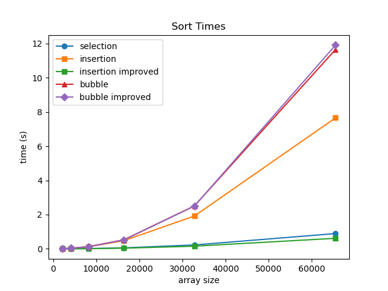
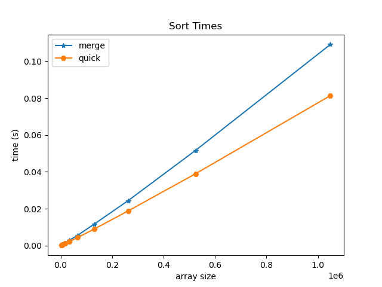

[..](../index.md)
> Data Structures (CSE 20312)
> Prof. Jay Brockman, Fall 2025

[mooc.fi](https://tira.mooc.fi/spring-2025/)

2025-08-27
===
> talked about unit tests and makefiles
in makefile:
* order does not matter! (uses algorithm that constructs dependency graph - topological sort)
* -g includes source code in compiled object file to allow for debugging
* -Wall is Warn all

### The C Language!
- C (followed B) by Ken Thompson, Dennis Ritchie 1973

Memory Management
- utilization
- security
- ease of programing

* C exposes (and makes you deal with) details of memory
* Python (which we will use later) does not

`sizeof(...)` tells you how many bytes a datatype stores:
```
bool, char -- 1
short -- 2
int, float -- 4
double -- 8
int* , char* -- 8
```

2025-08-29
===
- 64 bit addresses sent from processor to memory
- 8 bit channel of data to go back and forth between processor and memory
(not entirely sure what is meant by this yet)
### binary and hexadecimal numbers:
0 0000
1 0001
2 0010
3 0011
4 0100
5 0101
6 0110
7 0111
8 1000
9 1001
A 1010
B 1011
C 1100
D 1101
E 1110
F 1111

**At each memory address you can only store one byte**
- in most microprocessers, the least significant bit shows up in the lowest address in memory (little endian architecture)
    - (over the air serially often sent as big endian)

Ex:
`char c = 'A'; int x = 0xaabbccdd` (0x denotes hexadecimal)

|name |     address         |   value   |
|-----|---------------------|---------- |
| c   |    ~                |   0x41    |
|     |    (higher address) |   0xaa    |
|     |    ~                |   0xbb    |
|     |    ~                |   0xcc    |
| x   |    (lower address)  |   0xdd    |


### pointer variables
`int x = 1;`
`int *p;`   initializes start of 8 consecutive bytes in memory
`p = &x`    sets p to x's address found in lookup table
`*p = 5`    changes the value at the address stored in p to 5
 ^ dereference `*` here is an operator, different than the one used to initialize pointer p 

### example in zybooks
```c
#include <stdio.h>

int main()
{
    int x = 5;                  // x, y are ints
    int y = 1;
    int *p;                     // p, q are addresses of ints
    int *q;

    p = &x;                     // p gets address of x
    y = *p;                     // y gets value at address in p
    printf("y = %d\n", y);

    q = p;                      // q gets same address as p

    printf("*p = %d    *q = %d\n", *p, *q); 
}
```
^ used debugger to watch values change step by step

**Arrays are contiguous blocks of memory**
int a; a <---value of a
int A[5]; A <---points to the starting value (A[0]) of the array
```c
char char_v1;
int  int_v1;
char char_v2;
int  int_v2;
char char_array[4];
int  int_array[4];
```

```
Address of char_v1:        0x7ffcd1389526
Address of int_v1:         0x7ffcd1389528
Address of char_v2:        0x7ffcd1389527
Address of int_v2:         0x7ffcd138952c
Address of char_array[0]:  0x7ffcd1389544
Address of char_array[1]:  0x7ffcd1389545
Address of int_array[0]:   0x7ffcd1389530
Address of int_array[1]:   0x7ffcd1389534
```
^ variables of same data type follow each other sequentially in memory
  (i.e. by data type - not by order of declaration)

2025-09-01
===
### pointer arithmetic
recap: arrays are contiguous blocks of memory
- array of chars one after the other
- array of ints need space for 4 bytes between each (each address holds 1 byte)

what happens when you add 1 to a pointer?
- increments by the sizeof the variable it points to (then points to the next 
`*(ptr + 3)` <=> `ptr[3]`

### pointers and strings
- a string is just a null-terminated array of chars
- (`0` is the same as `'\0'`)
```c
char s[] = "abcde";
// _________________________________________________
// |  'a'  |  'b'  |  'c'  |  'd'  |  'e'  |   0   |
// | &s[0] | &s[1] | &s[2] | &s[3] | &s[4] | &s[5] |
// -------------------------------------------------
```
cool trick we can do:
```c
// Keep going while *(s + i) != 0 (false). (we could have also used s[i])
for (int i = 0;  *(s + i);  i++) {
    printf("%c", *(s + i));
}
```

### subtracting pointers
let `char *p` point to the `'\0'` in string s.
what is `p-s`?
- an int: the length of the string!

### memory management
- most important part of system design!

Variables: have names (created by compiler)
Dynamic memory: doesn't have name, but has pointer to reach it (created at runtime)

Regions of Memory:
```
ffffffffffffffff
_________________
Stack (grows downward)
- contains function local variables
______ vv _______


______ ^^ _______
Heap (grows upward)
- from malloc, calloc, free
_________________               ^^ created at runtime (above)^^   vv (below) created at compile time vv
DATA FIXED SIZE
- contains global variables, static variables, constant strings
_________________
(Text) Code
- contains machine code to run program
_________________
0000000000000000
```

### Heap: dynamic memory allocation in C

`void *malloc(n_bytes)`
- allocates n-bytes unitialized in memory

`void *calloc(n_objects, bytes_per_object)`
- allocates n-bytes of memory initialized to 0

`free(void *ptr)`
- how does free know how much memory to free?
- there must exist some table at runtime that keeps track of addresses allocated and how much!
- actually a fairly complicated task to efficiently pack the heap

- when you try to perform an operation on a segment/region in memory where you are not allowed to:
	- segmentation fault!
- growing the stack downward was a classic exploit in early computer systems for hackers to access/modify data and user code

### What happens when you call a function?
```c
void f3() { 
	// does something
}
void f1() { 
	// does something
}
void f2() {
    f3();
}

void main() {
    f1();
    f2();
}
```

- Starts at top of stack
- Allocates stack frame for `main`:
```
________  (TOP OF STACK)
| main |
-------- <-- stack pointer (points to the address below the top of the stack that has enough space for `main`'s variables)
```
- Allocates stack frame for `f1`:
```
________  (TOP OF STACK)
| main |
--------
|  f1  |
-------- <-- stack pointer 
```
- f1 returns, now f2 stack frame is allocated in exact same location as f1 was
```
________  (TOP OF STACK)
| main |
--------
|  f2  |
-------- <-- stack pointer 
```
- f2 calls f3
```
________  (TOP OF STACK)
| main |
--------
|  f2  |
--------
|  f3  |
-------- <-- stack pointer 
```
- returns all the way back
```
________  (TOP OF STACK)
| main |
-------- <-- stack pointer 
```
- every time a function calls, it allocates a stack frame
- every time a function returns, it deallocates the stack frame
- does this by changing what's called the stack pointer
- (the code that allocates/deallocates the stack frame doesn't have to be written in C)
	- in assembly, uses a register that is reserved to be your stack pointer
	- you move the stack pointer, and then reference values relative to the stack pointer

"Isn't this exceedingly clever?"
Key part of computer system design: you don't want to waste memory!
The nature of functions calling functions automatically takes care of this for you with a stack


2025-09-03
===
### call stack example
```c
int add(int m, int n) {
    m = m + n;
    return m;
}
void square(int *a) {
    *a = *a * *a;
}
int main() {
    int x = 1;
    int y = 1;

    int z = add(x, y);
    square(&z);

    printf("x=%d y=%d z=%d\n", x, y, z);

    return 0;
}
```

| name | address                      | value     |
| ---- | ---------------------------- | --------- |
| y    | 0x7...7e4 (highest in stack) | 1         |
| x    | 0x7...7e0                    | 1         |
| z    | 0x7...7dc                    | 2, then 4 |
| m    | 0x7...7bc                    | 1         |
| n    | 0x7...7b8                    | 1         |
| a    | 0x7...7b8 (replaces n)       | 0x7...7dc |

- when the stack frame of `add` expires, the stack frame of `square` can take its place
- note how `a`, which is a pointer of 8 bytes, replaces the address of n. This is because the `square` stack frame reallocated all eight bytes of the previous ints `m` and `n` (4+4 bytes) in order to store `a`.  Because the byte order is little endian, `a` starts at the lower address, where `n` previously started.


### Data segment
--> has global variables, statics, and string constants

`char a[] = "cat";` sizeof(a): 4
on main's stack frame:
```
_________________________________
|  'c'  |  'a'  |  't'  |   0   |
---------------------------------
```

---
`char *p = "dog";` sizeof(p): 8
**"dog" is a string constant!**
on main's stack frame:
```
_______________________________________________
|  pointer p to data segment(8 bytes)         |
-----------------------------------------------
```
in data segment:
```
_________________________________
|  'd'  |  'o'  |  'g'  |   0   |
---------------------------------
```

---
We cannot do: `p[0] = 'X'`! It is a string constant that lives in the data segment.
**note that global variables and static variables live in the data segment and _can_ be written to**

We can however reassign p to a different address: `p = &a`

But we cannot make an array point to a new address: `a = p` is illegal.
- Arrays are not pointer variables - they are fixed blocks of memory with a name (think compile-time alias to an address)
- In most expressions, the array name decays to a pointer to its first element (`&a[0]`), but this is a value the compiler produces, not something stored that you can reassign.

2025-09-05
===
### where do variables go in memory?
```c
double GLOBAL = 3.14;
int main() {
    int int_scalar = 25;
    int int_array[] = {100, 101, 102, 103};
    char *str_const = "hello";
    int *malloc_array = malloc(10*sizeof(int))
    static int static_int = 2;
```
- Stack: `&int_scalar`, `int_array`, `&str_const`, `&malloc_array`
- Heap: `malloc_array`
- Data: `str_const`, `&static_int`, `&GLOBAL`
- Code: `main`
```
---------------------------stack----------------------------
    int_array: 0x7ffc090b24d0,    *int_array: 100
&malloc_array: 0x7ffc090b24c8,  malloc_array: 0x652de1f3d2a0
   &str_const: 0x7ffc090b24c0,     str_const: 0x652dbe49b008
  &int_scalar: 0x7ffc090b24bc,    int_scalar: 25
----------------------------heap----------------------------
 malloc_array: 0x652de1f3d2a0, *malloc_array: 0
----------------------------data----------------------------
  &static_int: 0x652dbe49d018,    static_int: 2
      &GLOBAL: 0x652dbe49d010,        GLOBAL: 3.140000
    str_const: 0x652dbe49b008,    *str_const: h
----------------------------code----------------------------
         main: 0x652dbe49a1a9,    *(unsigned char*)main: 0xf3   <- first opcode! (first byte of first instruction of main)
```
- mailbox -> contents analogy breaks down a bit for arrays - `arr` is not a box containing a pointer but more like a label for the whole row of boxes glued together.
- It's just a design choice in C that when you use `arr` in most expressions, the compiler treats it as the address of the first box (array decays to a pointer). You then use `*` or `[]` to access the individual values inside those "glued boxes".

### I/O: printing strings:
```c
char *string = "hello"

printf("%s\n", string);

puts(string); // only takes in strings; prints with a new line
```

### reading input line by line
can use scanf, but we'll usually use fgets
```c
char buffer[BUFSIZ]; // BUFSIZ is a constant defined in <stdio.h> (a couple thousand characters, more than enough)
while (fgets(buffer, BUFSIZ, stdin)) {
    // process the buffer (maybe strdup into an array of strings)
}
```
small downside: fgets also captures newline `\n`.  We can "chomp":
- Iterate through the buffer until you get to NULL character. If you encounter `\n`, replace with `\0` and break.
    - e.g. `['c', 'a', 't', '\n', '\0']` --> `['c', 'a', 't', '\0', '\0']`, which functionally is just `['c' 'a' 't' '\0']`

### Arrays of strings
- `char** strarray`: (i.e. `(char*) *strarray`)
	- use `calloc` to allocate an array of null pointers
	- use `strdup` to allocate individual strings (e.g. from buffer) to each of those pointers
```
_____
| * |  strarray (on stack)
-----
  | (points to first pointer in heap) 
  |
__V__
| * | - - >|'c'|'a'|'t'|'\0'|  (each string also exists somewhere in heap, not necessarily in order among each other)
-----
| * | - - >|'d'|'o'|'g'|'\0'|
-----
| * | - - >|'m'|'o'|'u'|'s'|'e'|'\0'|
-----
```
To free this whole array of strings is sorta complicated:
- must first free strings individually, then free the pointers that pointed to those strings (everything exists on the heap except for the strarray pointer)

2025-09-08
===
### reading user data into an array of strings (continuing from last class)
```c
char  **read_user_data(FILE *stream, int nstrings) {
    char buffer[80]; // Up to 80 characters per string
    char **sarray = calloc(nstrings, sizeof(char*)); // use calloc so that we have 0s at end to use as sentinel
    int i = 0;
    while (fgets(buffer, 80, stream)) {
        chomp(buffer);
        *(sarray+i) = strdup(buffer);
        i++;
    }
    return sarray;
}
```
### freeing a list of strings `char** strarray`
using `free`:
1. delete each string
2. delete each pointer
```c
void free_string_array(char **sarray) {
    for (int i = 0; sarray[i]; i++) {
        free(sarray[i]); // free each individual string
    }
    free(sarray); // free the array of string pointers
}
```

### Abstract Data Types (ADTs)
- a "big idea", defined by operations it supports
- internal details hidden from user

Today: Dynamic Array
Wednesday: Other ADTs on top of Dynamic Array (Stack, Queue, Set)

- ADTs are related to object oriented programming (but you don't _need_ an object oriented programming language to implement ADTs)

### review of structs:
Example: Point with x and y
```c
struct Point {
    int x;
    int y;
};
```
nicer to do:
```c
typdef struct {
    int x;
    int y;
} Point; 
```

`Point p; p.x = 1; p.y = 2;`

| Label           | Address | Value    |
| --------------- | ------- | -------- |
| (y)             | Ox...F  | 0x00     |
| (y)             | Ox...E  | 0x00     |
| (y)             | Ox...D  | 0x00     |
| start of y      | Ox...C  | 0x10 (2) |
| (x)             | Ox...B  | 0x00     |
| (x)             | 0x...A  | 0x00     |
| (x)             | 0x...9  | 0x00     |
| p -> start of x | 0x...8  | 0x01 (1) |

- compiler typically pads struct size to power of 2

```c
#include <stdio.h>
#include <stdlib.h>
#include <string.h>

typedef struct {
    char *name;
    int  age;
} Person;

int main() {
    // Declare a Person as a local variable
    Person p;
    p.name = "James";
    p.age = 20;

    // Allocate a Person on the heap
    Person *p_ptr = malloc(sizeof(Person));
    p_ptr->name = strdup("Madison");
    p_ptr->age = 21;

    printf("sizeof(p): %lu\n", sizeof(p)); // 16 (would have expected it to be 12 for char* and int)
    printf("sizeof(*p_ptr): %lu\n", sizeof(*p_ptr)); // 16

    free(p_ptr->name);
    free(p_ptr);
}
```

### Dynamic Array: Overview
- consists of an internal array that can grow dynamically
- need to keep track of:
    - data array
    - capacity
    - size
```
____________
| data     | ------> |__1__|__4__|__3__|_____|_____|
------------
| capacity | = 5 (how much total space in internal data array) 
------------
| size     | = 3 (number of elements stored within capacity)
------------
```
### methods:
`array_create()`
- create new empty array
`array_delete(Array *)`
- free an array and its contents
`array_append(Array *, int value)`
- add an element to the end of the array (if full, reallocate to double capacity and copy over values if needed-e.g.)
`array_at(Array *array, int index)`
- return the value at an index
`array_index(Array *array, int value)`
- return the first index with a given value
`array_insert(Array *array, int index, int value)`
- insert a new value at an index (and shifts elements after it to the right)

### Growing an Array: realloc
`void* realloc(void *p, size_t size)` (`size_t` typically unsigned long int)
- takes in original array and new size (bytes)
- returns new array (with elements copied over)

### Shifting elements to the right
```
                              |--[size]
                              v
|__31__|__32__|__33__|__35__|____|____|____|____|
                     ^__want to insert(34, at index 3)
```
from: size
to: index
we set: data[i] = data[i-1]

### Computational Complexity
space/time efficiency
Big O Notation
O(1): constant
O(N): proportional to N
O(N^2): proportional to N^2 
...(covered more later)

Average (A) and Worst Case (W)

| Function | Time (A) | Time (W)            | Space (A) | Space (W)      |
| -------- | -------- | ------------------- | --------- | -------------- |
| Append   | O(1)     | O(N) (realloc+copy) | O(1)      | O(N)           |
| At       | O(1)     | O(1)                | O(1)      | O(1)           |
| Index    | O(N)     | O(N)                | O(1)      | O(1)           |
| Insert   | O(N)     | O(N)                | O(1)      | O(N) (realloc) |

- Will get into the C code for Dynamic Arrays next class!

2025-09-10
===
- Abstraction: hiding detail and exposing the interface
### Dynamic Array C code
array.h
```c
#pragma once // (so that everything is included only once)

#include <stdbool.h>
#include <stdlib.h>

/* Constants */
#define ARRAY_DEFAULT_CAPACITY 1 << 2 // 4 elements

/* Structure */
typedef struct {
    int	  *data;	// Internal array
    int   capacity;	// Total number of elements
    int   size;     // Number of valid elements
} Array;

/* Functions */
Array*  array_create();
void    array_delete(Array *array);
void    array_append(Array *array, int value);
int     array_at(Array *array, int index);
int	    array_index(Array *array, int value);
void    array_insert(Array *array, int index, int value);
```
array.c
```c
#include "array.h"
#include <assert.h>
#include <string.h>

Array *array_create() {
    // Allocate Array structure
    Array *array = malloc(sizeof(Array));

    // Initialize capacity and size
    array->capacity = ARRAY_DEFAULT_CAPACITY;
    array->size = 0;

    // Allocate the data array
    array->data = malloc(array->capacity * sizeof(int));

    // return pointer to Array
    return array;
}

void array_delete(Array *array) {
    // Free the data array
    free(array->data);
    
    // Free the Array structure
    free(array);
}

void array_append(Array *array, int value) {
    // If the size is at capacity, double the capacity
    if (array->size == array->capacity) {
        array->capacity *= 2;
        array->data = realloc(array->data, array->capacity * sizeof(int));
    }
    // Store value at end of array and increment size
    array->data[array->size] = value;
    array->size++;
}

int array_at(Array *array, int index) {
    // Return the value at the index
    return array->data[index];
}

int array_index(Array *array, int value) {
    // Scan internal array for first element 
    // that matches value and return its index         
    for (int index = 0; index < array->size; index++)
        if (array->data[index] == value) {
            return index;
        }
    return -1; // Return -1 if no match found
}

void array_insert(Array *array, int index, int value) {
    // If the size is at capacity, double the capacity
    if (array->size == array->capacity) {
        array->capacity *= 2;  // Double the capacity
        array->data = realloc(array->data, array->capacity * sizeof(int));
    }

    // Shift the values from index to the end of the array one element ahead
    for (int i=array->size; i>index; i--) {
        array->data[i] = array->data[i-1];
    }

    // Store new value and increment size
    array->data[index] = value;
    array->size++;
}
```

### Stack: Overview
Push: add element to top
Pop: remove element from top
Top: peek at top
Empty: true if stack is empty
```
|   | 
|   |
| 3 | <--Top of Stack
| 2 |
| 1 | 
-----
```

### Parentheses, Brackets, Braces Matching:
valid PBB Matching:
```
(){}[]
{[()]}
{}[]
```
invalid:
```
[)]
[{()]}
```
**We can use the stack to write an algorithm to detect valid PBBs!**:
traverse string in order left to right:
- push opening PBBs to stack
- if encounter a closing PBB, pop from stack and check if the popped opener matches the closer
```pseudocode
for each input char c:
	if c is an opener:
		push c on stack
	else:
		if stack empty: return false
		if c is closer that matches top:
			pop stack
		else:
			return false
if stack is empty:
	return true
else:
	return false
```

2025-09-12
===
- using principles of object oriented programming to create
- abstraction (push and pop methods) and inheritance (stack "inherits" from dynamic array)
### Implementing Stack, based on our previous implementation of Dynamic Array
stack.h
```c
#pragma once
#include "array.h"

/* Structures */
typedef Array Stack;

/* Functions */
Stack*  stack_create();
void    stack_delete(Stack *stack);
void    stack_push(Stack *s, int value);
int     stack_pop(Stack *s);
int     stack_top(Stack *s);
bool    stack_empty(Stack *s);
```
stack.c
```c
#include "stack.h"
#include <assert.h>

Stack* stack_create() {
    return array_create();
}

void stack_delete(Stack *stack) {
    array_delete(stack);
}

void stack_push(Stack *stack, int value) {
    array_append(stack, value);
}

int stack_top(Stack *stack) {
    assert(stack->size > 0);
    return array_at(stack, stack->size - 1);
}

int stack_pop(Stack *stack) {
    int top = stack_top(stack); // will assert false if stack is empty
    stack->size--;
    return top;
}

bool stack_empty(Stack *stack) {
    return stack->size == 0;
}
```

### Implementing Parentheses, Brackets, Braces Matching Algorithm:
```c
#include <stdbool.h>
#include <stdio.h>
#include <stdlib.h>
#include <string.h>

#include "stack.h"

void chomp(char *str) {
    size_t size = strlen(str);
    if (*(str + size - 1) == '\n') *(str + size - 1) = 0;
}

bool is_pbb_matched(char *s) {
    Stack *stack = stack_create();

    for (char *c = s; *c; c++) {
        // if char is an opener, push 
        if (*c == '{' || *c == '[' || *c == '(') {
            stack_push(stack, *c); // push ascii value of opener
        // else if char is a closer that match opener on stack, pop
        } else if (!stack_empty(stack) && 
                    ((*c == '}' && stack_top(stack) == '{') ||
                    (*c == ']' && stack_top(stack) == '[') ||
                    (*c == ')' && stack_top(stack) == '('))) {
            stack_pop(stack);
        // else no match
        } else {
            stack_delete(stack);
            return false;
        }
    }
    if (stack_empty(stack)) {
        stack_delete(stack);
        return true;
    } else {
        stack_delete(stack);
        return false;
    }
}

int main(int argc, char *argv[]) {
    char buffer[BUFSIZ];
    while (fgets(buffer, BUFSIZ, stdin)) {
        chomp(buffer);
        puts(is_pbb_matched(buffer) ? "pbb-matched" : "not pbb-matched");
    }
    return 0;
}
```

### Stack vs. Queue

stack: Last In, First Out (LIFO)
```
___________________v---push and pop only on one end
|
--------------------
```
queue: First In, First Out (FIFO)
```
pop---v___________________v---push
         (like a pipe!)
       -------------------
```
methods for queue:
- push
- pop
- front
- empty

Complexity of Queue (implemented with a Dynamic Array):

| Function | Time (Avg)                      | Space (Avg) |
| -------- | ------------------------------- | ----------- |
| Push     | O(1)                            | O(1)        |
| Pop      | O(N) - have to shift everything | O(1)        |
| Front    | O(1)                            | O(1)        |
| Empty    | O(1)                            | O(1)        |

deque (double ended queue):
```
push, pop--v_________________________________v---push, pop
             (pipe that can flow either way) 
            ---------------------------------
```
methods for queue:
- push left, push right
- pop left, pop right
- front
- empty

### Set
- a "big bag of stuff" (unique, unordered stuff!)
methods:
- add(value)
- contains(value)
- remove(value

Complexity of Set (implemented with a Dynamic Array):

| Function | Time (Avg) | Space (Avg) |
| -------- | ---------- | ----------- |
| Add      | O(1)       | O(1)        |
| Contains | O(N)       | O(1)        |
| Remove   | O(N)       | O(1)        |

### Algorithm analysis
constant time operations: operations that take the same amount of time regardless of data value
- arithmetic operations
- variable assignments
- loops with fixed number of iterations
- indexing into an array
- comparisons

Big O Notation:
- IGNORE CONSTANTS
- if sum of terms, take the highest order term
- if product of terms, take the product of orders

### Classic Big O Complexities:
O(1)
- array lookup and compare: `if a[i] == key`

O(N)
- for loops: `for (i=0; i < size; i++) { do something O(1) }`

O(N^2), and other polynomials
- typically nested for loops `for (i=0; i < size; i++) { do something O(N) }`

O(log N)
- Divide and Conquer (e.g. binary search)
```
|__0__|__3__|__7__|__9__|__25__|__47__|__83__|
					 ^--look at mid: > or < than key? (discard other half & repeat until mid==key)
```
- The most number of times we would need to cut in half is log_2(n)
- an array of 2^(20) elements would only take at most 20 steps to cut down to key 

O(N log N)
- Divide into O(log N) subproblems, where each subproblem is O(N) to solve
- sorting algorithms can get to this speed

O(C^N), O(N!) - exponential, non-polynomial
- guessing a password by trying all combinations

2025-09-15
===
### Comparing linear and binary search times
binary search is much faster!!
10,000 trials on sorted array of 2^(20) elements:
- 9.40 sec vs. 0.00115 sec

### Some examples: what is their complexity?
example 1: dot products
O(N) because each element is multiplied and added pairwise

example 2: matrix multiplication
O(N^3)
```
for each row
	for each column
		take dot product - O(N)
```

example 3:
Euclidian GCD - greatest common divisor of a and b
(where N is bit length of a and b)
1. Ensure that a is greater than b. If b is greater than a, swap the values of a and b.
2. Computer the remainder of r of a divided by b
3. If r is equal to 0, then the GCD of a and b is b.  Otherwise, set a to b and b to r, and go back to step 2

- in terms of bit length, O(N) ~losing a bit of significance each time
- in terms of the magnitude of the numbers, O(log N) ~remainder is at most the difference between a and b

### Recursion
- an algorithm that breaks a problem into subproblems and applies the algorithm itself
- needs a base case when can't subdivide further

Why recursion?
- useful for structures that are also recursive (like trees)
- lots of things can be seen as recursive! (e.g. arrays could be seen as unit element followed by array of length n-1)
- However, usually does not save time and space (particularly not space)

Basic recursive function:
```
recursive(data):
	if (base case):
		perform base action
		return
	else
		recursive(reduced data)
```
Variants:
- sometimes return data value
- more than one base case
- more than one recursive call (e.g. recurse left, recurse right)

Examples:
- factorial
- cumulative sum
- print list reversed
- linear search
- binary search
- has duplicates
- reverse list
- fibonacci

```c
int cumulative_sum(int n) {
    if (n == 0) {
        return 0;
    }
    return n + cumulative_sum(n-1);
}

int factorial(int n) {
    if (n == 0) {
        return 1;
    }
    return n * factorial(n - 1);
}

void print_string(char *s) { // "every string is a character followed by another string"
    if (*s == '\0') {
        putchar('\n');
        return;
    }
    putchar(*s);
    print_string(s+1);
}
```

2025-09-17
===
continuing recursion:
```c
void reverse_array(int *list, int start_index, int end_index) {
    if (start_index >= end_index) { // 0 or 1 elements left in middle
        return;
    }
    // swap elements
    int temp = list[start_index];
    list[start_index] = list[end_index];
    list[end_index] = temp;

    reverse_array(list, start_index + 1, end_index - 1);
}

int linear_search(int *numbers, int high, int key) {
    if (high < 0) {
        return -1;
    }
	if (numbers[high] == key) {
        return high;
    }

    return linear_search(numbers, high - 1, key);
}

int binary_search(int *numbers, int low, int high, int key) {
	if (low > high)
		return -1;

	int mid = (low + high) / 2;

	if (key > numbers[mid])
		return binary_search(numbers, mid+1, high, key);

	if (key < numbers[mid])
		return binary_search(numbers, low, mid-1, key);

   return mid;
}

bool has_duplicate(int *array, int high) {
    if (high == 0)
        return false;

    if (linear_search(array, high-1, array[high]) >= 0)
        return true;

    return has_duplicate(array, high-1);
}

int fibonacci_number(int n) {
	if (n == 0)
		return 0;
	if (n == 1)
		return 1;
	return fibonacci_number(n - 1) + fibonacci_number(n - 2);
}

```

### Recurrence Relations
- look in book
- good review for discrete math, not going to cover extensively in this class

Recurrence relation for factorial:
```
(k)
 |
(k)
 |
(k)
 |
... (repeated n times)

T(N) = k + T(N-1) => O(N)
```

Recurrence relation for has_duplicate:
```
(N)
 |
(N-1)
 |
(N-2)
 |
... (repeated n times)

T(N) = N + T(N-1)
	 = N + N-1 + ... + 1 = (N+1)*(N/2) => O(N^2)
```

### Sorting
[Sorting Cards Exercise](https://anim.ide.sk/sortingcards.php)

2025-09-19
===
### Bubble Sort
```c
void BubbleSort(int *numbers, int numbersSize) {
   for (int i = 0; i < numbersSize - 1; i++) {
      for (int j = 0; j < numbersSize - i - 1; j++) {
         if (numbers[j] > numbers[j+1]) {
            int temp = numbers[j];
            numbers[j] = numbers[j + 1];
            numbers[j + 1] = temp;
         }
      }
   }
}
// or...
void BubbleSort(int *numbers, int numbersSize) {
   int i = numbersSize - 1;
   while (i > 0) {
      for (int j = 0; j < i; j++) {
         if (numbers[j] > numbers[j + 1]) {
            int temp = numbers[j];
            numbers[j] = numbers[j + 1];
            numbers[j + 1] = temp;
         }
      }
      i--;
   }
}
```

### Insertion Sort
```c
void InsertionSort(int *numbers, int numbersSize) {
    for (int i = 1; i < numbersSize; ++i) {
        int j = i;
            // Insert numbers[i] into sorted part
            // stopping once numbers[i] in correct position
            while (j > 0 && numbers[j] < numbers[j - 1]) {
            // Swap numbers[j] and numbers[j - 1]
            int temp = numbers[j]; 
            numbers[j] = numbers[j - 1];
            numbers[j - 1] = temp;
            --j;
        }
    }
}
```

### Space Complexity
- Space complexity is how much _ancillary_ space you need to allocate for the algorithm
	- bubble sort and insertion sort both have O(1) space complexity

### Adaptiveness and Stability
**Adaptiveness: Takes advantage of partial sort**
- selection sort is not adaptive
- insertion sort is adaptive (if array is already sorted, it would only need one pass)
- bubble sort is not adaptive (always O(n^2))

- we can modify bubble sort to make it adaptive
	- keeps track of the last swap (if unable to make further swaps, we know everything after it must be sorted):
```c
void BubbleSortImproved(int *numbers, int numbersSize) {
   int last;  // last swap index
   for (int i = 0; i < numbersSize - 1; /* i updated below using last */) {
      last = -1;
      for (int j = 0; j < numbersSize - i - 1; j++) {
         if (numbers[j] > numbers[j + 1]) {
            int temp = numbers[j];
            numbers[j] = numbers[j + 1];
            numbers[j + 1] = temp;
            last = j;
         }
      }
      if (last == -1) break;                 // already sorted
      i = numbersSize - last - 1;            // shrink checked range
   }
}
// or...
void BubbleSortImproved(int *numbers, int numbersSize) {
   int i = numbersSize - 1;
   while (i >= 1) {
      int last = -1;
      for (int j = 0;  j < i;  j++) {
         if (numbers[j] > numbers[j+1]) {
            int temp = numbers[j];
            numbers[j] = numbers[j + 1];
            numbers[j + 1] = temp;
            last = j;
         }
      }
      i = last;
   }
}
```

We can also improve insertion sort (saves on write instructions):
```c
void InsertionSortImproved(int *numbers, int numbersSize) {
    for (int i = 1;  i < numbersSize;  i++) {
        int j = i - 1;
        int tmp = numbers[i];
        while ((j >= 0) && (numbers[j] > tmp)) {
            numbers[j+1] = numbers[j];
            j = j - 1;
        }
        numbers[j+1] = tmp;
    }
}
```

**Stability: If two elements have the same the value, order will not be changed**
- there may be additional information that would be messed up by switching order
- selection sort is not stable
- ex: `[2a, 2b, 1, 3, 4, 5]` would go to `[1, 2b, 2a, 3, 4, 5]`

---
O(N^2) sorting algorithms build up sorted region through multiple passes
- Which is fastest (out of algorithms we have seen so far)?
- Let's test!
	- Insertion sort (adaptive and stable; with enhancement is fastest)
	


---
O(N log N) sorting algorithms build up a sorted order by dividing the problem and combining results.

### Merge sort
> did example in class physically sorting 16 people by first name using merge sort (cool!)
> - start as individual
> - merge into pairs
> - merge pairs into new order (only comparing first of each pair)
> - pair groups of 4 ... and so on ...(only comparing first of each order)

best, average, and worst time complexity: O(N log N)
space complexity: O(N) - need ancillary array of size N

### Quicksort
average time complexity: O(N log N) - usually, depending on data/choices
average space complexity: O(log N) - auxiliary due to recursion stack
- partition array via swaps into regions above or below a pivot value
- pivot value can be chosen arbitrarily (first, last, middle, random, or median-of-three).
- small note: values in array equal to the pivot value can be in either partition (implementation-dependent)
- another note: we are not sorting around the pivot index - we are sorting around its value
	- if we didn't use strict comparisons (> and <), the element from which we assigned the pivot can move
```
pivot_value = 4 (pick middle element)

|__3__|__6__|__1__|__4__|__7__|__2__|__5__|
   ^--low_index                        ^--high_index

while low_index <= high index:
	increment low_index until array[low_index] > pivot_value
	decrement high_index until array[high_index] < pivot_value
	swap array[low_index] with array[high_index]

then, given ending position of low_index,
	recursively apply sort on low partition (orig_low_index to ending_low_index) 
	recursively apply sort on high partition (ending_low_index+1 to orig_high_index) 
```

Worst case: if pivots are always bad, it basically turns into selection sort
- time complexity: O(N^2)
- space complexity: O(N)
- example: pick pivot as lowest element, and array is already sorted
- [website to visualize](https://visualgo.net/en/sorting)
- if we pass a sorted array to quicksort (picking pivot at index 0), you can visualize how it must recurse at every element (N times)

2025-09-22
===
[Merge Sort Visualization](https://opendsa-server.cs.vt.edu/ODSA/Books/Everything/html/Mergesort.html)
[Quicksort & Merge Sort](https://anim.ide.sk/sorting_algorithms_2.php)

Recap:
- bad pivot values => bad partitions => O(N^2) instead of O(N log N)
- merge sort is stable, quicksort is not

### Merge Sort C code
```c
#include <stdlib.h>

void Merge(int *numbers, int i, int j, int k) {
   int mergedSize = k - i + 1;               // Size of merged partition
   int mergePos = 0;                         // Position to insert merged number
   int leftPos = 0;                          // Position of elements in left partition
   int rightPos = 0;                         // Position of elements in right partition
   // Dynamically allocates temporary array for merged numbers
   int *mergedNumbers = malloc(mergedSize * sizeof(int));   
   leftPos = i;                          // Initialize left partition position
   rightPos = j + 1;                     // Initialize right partition position
   
   // Add smallest element from left or right partition to merged numbers
   while (leftPos <= j && rightPos <= k) {
      if (numbers[leftPos] <= numbers[rightPos]) {
         mergedNumbers[mergePos] = numbers[leftPos];
         ++leftPos;
      }
      else {
         mergedNumbers[mergePos] = numbers[rightPos];
         ++rightPos;
         
      }
      ++mergePos;
   }
   
   // If left partition is not empty, add remaining elements to merged numbers
   while (leftPos <= j) {
      mergedNumbers[mergePos] = numbers[leftPos];
      ++leftPos;
      ++mergePos;
   }
   
   // If right partition is not empty, add remaining elements to merged numbers
   while (rightPos <= k) {
      mergedNumbers[mergePos] = numbers[rightPos];
      ++rightPos;
      ++mergePos;
   }
   
   // Copy merge number back to numbers
   for (mergePos = 0; mergePos < mergedSize; ++mergePos) {
      numbers[i + mergePos] = mergedNumbers[mergePos];
   }
   free(mergedNumbers);
}

void MergeSort(int *numbers, int i, int k) {
   int j = 0;
   
   if (i < k) {
      j = (i + k) / 2;  // Find the midpoint in the partition
      
      // Recursively sort left and right partitions
      MergeSort(numbers, i, j);
      MergeSort(numbers, j + 1, k);
      
      // Merge left and right partition in sorted order
      Merge(numbers, i, j, k);
   }
}
```

| **MERGE SORT** | Time Complexity | Space Complexity |
| -------------- | --------------- | ---------------- |
| Best Case      | O(N log N)      | O(N)             |
| Average Case   | O(N log N)      | O(N)             |
| Worst Case     | O(N log N)      | O(N)             |
| --             |                 |                  |
| Adaptive?      | No              |                  |
| Stable?        | Yes             |                  |

side note: python uses Timsort, which essentially uses merge sort down to subarrays of 32 elements, and then uses insertion sort (which is adaptive)

### Quicksort 
```c
#include <stdbool.h>

int Partition(int *numbers, int lowIndex, int highIndex) {
    // Pick middle element as pivot
    int midpoint = lowIndex + (highIndex - lowIndex) / 2;// avoids overflow, otherwise same as (highIndex + lowIndex) / 2;
    int pivot = numbers[midpoint];

    bool done = false;
    while (!done) {
        while (numbers[lowIndex] < pivot) {
            lowIndex += 1;
        }
        while (pivot < numbers[highIndex]) {
            highIndex -= 1;
        }
        // If zero or one elements remain, then all numbers are partitioned. Return highIndex.
        if (lowIndex >= highIndex) {
            done = true;
        } else {
            // Swap numbers[lowIndex] and numbers[highIndex]
            int temp = numbers[lowIndex];
            numbers[lowIndex] = numbers[highIndex];
            numbers[highIndex] = temp;
            // Update lowIndex and highIndex
            lowIndex += 1;
            highIndex -= 1;
        }
    }
    // this will be the top of the low end for the next call
    return highIndex;
}

void Quicksort(int *numbers, int lowIndex, int highIndex) {
    // Base case: If the partition size is 1 or zero
    // elements, then the partition is already sorted
    if (lowIndex >= highIndex) {
        return;
    }
    // Partition the data within the array. Value lowEndIndex
    // returned from partitioning is the index of the low
    // partition's last element.
    int lowEndIndex = Partition(numbers, lowIndex, highIndex);
	
    Quicksort(numbers, lowIndex, lowEndIndex);// recursively sort low partition
    Quicksort(numbers, lowEndIndex + 1, highIndex);// recursively sort high partition
}
```

```c
// from https://anim.ide.sk/sorting_algorithms_2.php
// Basically the same thing, may do one extra swap with itself
void Quicksort(int *a, int beg, int end) {
	int i = beg;
    int j = end;
    int pivot = a[(i + j) / 2];
	while (i <= j) {  // i, j need to cross for next call
		while (a[i] < pivot) 
            i++;
        while (a[j] > pivot) 
            j--;
        if (i <= j) {
            // one last swap with yourself--no harm
            int temp = a[i];
            a[i] = a[j];
            a[j] = temp;
            i++;
            j--;
        }
    }
    if (beg < j) 
        Quicksort(a, beg, j);
    if (i < end) 
        Quicksort(a, i, end);
}
```

| **QUICKSORT** | Time Complexity | Space Complexity |
| ------------- | --------------- | ---------------- |
| Best Case     | O(N log N)      | O(log N)         |
| Average Case  | O(N log N)      | O(log N)         |
| Worst Case    | O(N^2)          | O(N)             |
| --            |                 |                  |
| Adaptive?     | No              |                  |
| Stable?       | No              |                  |

### Comparison:

**NOTE**: we did not cover radix sort in class, but may it be useful to review for interviews!

### 2 main data structure implementations:
1. (dynamic) array based
2. linked

Linked Data structures:
- linked lists
- trees
- graphs

For Recursive Data Structures:
- a child of a tree is a tree
- the rest of a list is a list

### Linked Lists
made up of list nodes:
```
		_________      _________
Value:	| Blue  |      |  Red  |
		---------      ---------
Next:	|   *---|-->   |   *---|--> null
		---------      ---------
*Head-------^

```
first element in list we call the head
- head pointer lives in the stack

in class balloon demo: when inserting/removing elements, don't let go of any balloons! (memory leaks/dangling pointers)

### insert node at head of list

```c
Node *list_add_head(Node *head, int value) {
    Node *n = malloc(sizeof(Node));
    n->value = value;
    n->next = head;
    return n;
}
```

### delete node from head of list
```c
Node *list_remove_head(Node *head) {
    Node *n = head;
    head = n->next;
    free(n);
    return head;
}
```

2025-09-24
===
...continuing Linked Lists:
recap: when allocating variables on the heap, unless you maintain contact with them (using pointer), the balloon will float away (memory leak)!

### Pointer Chasing (printing a linked list)
`head --> [ ] --> [ ] --> [ ] --> 0`
set n = head, move down the list!
```c
void list_print_iterative(Node *head) {
    for (Node *n = head; n != NULL; n = n->next) { // don't do n++! nodes are not sequential like arrays
        printf("%d ", n->value);
    }
    printf("\n");
}
```

### Adding node after current node
```
         curr
	      ↓
head --> [1] -x-> [3] --> [4] --> 0
	      ↓        ↑
 (malloc) n  -->  [2]
```
```c
void list_add_after(Node *curr, int value) {
    Node *n = malloc(sizeof(Node));
    n->value = value;
    n->next = curr->next;
    curr->next = n;
}
```

### Removing node after current node
```
         curr            successor
	      ↓     (free!)    ↓ 
head --> [1] -x-> [3] --> [4] --> 0
	      ↓                ↑
          -->-->-->-->-->--^
```
```c
void list_remove_after(Node *curr) {
    Node *successor = curr->next->next;
    free(curr->next);
    curr->next = successor;
}
```

### Print list recursively
```c
void list_print_recursive(Node *head) {
    if (head == NULL) {
        printf("\n");
        return;
    }
    printf("%d ", head->value);
    list_print_recursive(head->next);
}

void list_print_reversed_recursive(Node *head, Node *curr) {
    if (curr == NULL) {
        return;
    }
    list_print_reversed_recursive(head, curr->next); // recurse _before_ we print
    printf("%d ", curr->value);
    if (curr == head) printf("\n"); // same head is passed to every recursive call
}
// called as: list_print_reversed_recursive(head, head);
```

### Deleting a Linked LIst
```c
void list_delete_iterative(Node *head) {
    while (head != NULL) {
        Node *n = head;
        head = head->next;
        free(n);
    }
}
void list_delete_recursive(Node *head) {
    if (head == NULL) {
        return;
    }
    list_delete_recursive(head->next); // recurse first!
    free(head);
}
```

### Stack implemented using Linked List
recall:
- when using Dynamic Arrays for stacks, we pushed/popped at the end of the array.
- otherwise we would have had to shift elements - O(N)

for linked lists:
- we push/pop at the head - O(1)
- otherwise pushing/popping at the tail requires O(N) traversal

### Queue using a Linked List
- because we push at one end and pop at the other end, one operation will have to be O(N)
- but what if we add a tail?
```
								  tail (push only)
								  ↓
head --> [ ] --> [ ] --> [ ] --> [ ] --> 0
```
- then, we can push to the tail and pop from the head
- **NOTE**: we cannot pop from the tail, because we cannot cannot look backwards!!!
- this brings us to doubly linked lists...

2025-09-26
===

### Queue using Linked list
recap:
- insert at tail & remove at head (easy)
- insert at head & remove at tail (hard - we can't see backwards!)
- we need prev pointers if we want both operations at tail
- therefore...
### Deque (double ended queue) using Doubly-Linked List
- each note contains next and prev:
```
				 (head)                         (tail)
				_________      _________      _________
Value:			| Blue  |      |  Red  |      | Green |
				---------      ---------      ---------
Next:			|   *---|-->   |   *---|-->   |   *---|--> null
				---------      ---------      ---------
Prev:   null <--|---*   |   <--|---*   |   <--|---*   |
				---------      ---------      ---------
```
- aside: one of the few places that python uses doubly-linked lists is for its implementation of deque
	- queues aren't generally used for large amounts of data (too much auxiliary space)
- limitation/awkwardness of linked lists: need to check boundary conditions (is_empty, adding/removing head or tail)
	- solution: Doubly-linked list with dummy elements
	- now: `head->next` refers to first element in list, `tail->prev` refers to the last
```
  head                                   tail
   ↓                                      ↓ 
[dummy] <-> [10] <-> [20] <-> [30] <-> [dummy]
```

### Doubly Linked List Implementation
```c
#include <stdio.h>
#include <stdlib.h>

// Definition of a Node
typedef struct Node {
    int data;
    struct Node* prev;
    struct Node* next;
} Node;

// Definition of a Doubly Linked List
typedef struct DoublyLinkedList {
    Node* head;  // Dummy head
    Node* tail;  // Dummy tail
} DoublyLinkedList;

// Create a new node
Node* create_node(int data) {
    Node* new_node = (Node*)malloc(sizeof(Node));
    new_node->data = data;
    new_node->prev = new_node->next = NULL;
    return new_node;
}

// Initialize the doubly linked list with Dummy nodes
DoublyLinkedList* create_list() {
    DoublyLinkedList* list = (DoublyLinkedList*)malloc(sizeof(DoublyLinkedList));
    list->head = create_node(0);  // Dummy head
    list->tail = create_node(0);  // Dummy tail
    list->head->next = list->tail;
    list->tail->prev = list->head;
    return list;
}

// Check if the list is empty
int is_empty(DoublyLinkedList* list) {
    return list->head->next == list->tail;
}

// Helper function: Insert node after current node
void insert_after(Node *current, int data) {
    Node* new_node = create_node(data);
    Node* next_node = current->next;

    current->next = new_node;
    new_node->prev = current;
    new_node->next = next_node;
    next_node->prev = new_node;
}

// Helper function: Remove current node and return data
int pop(Node* current) {
    int data = current->data;
    current->prev->next = current->next;
    current->next->prev = current->prev;
    free(current);
    return data;
}

// Prepend an element to the head  of the list
void prepend(DoublyLinkedList* list, int data) {
    insert_after(list->head, data);
}

// Append an element to the tail of the list
void append(DoublyLinkedList* list, int data) {
    insert_after(list->tail->prev, data);
}

// Remove the (non-dummy) head of the list and return value
int pop_head(DoublyLinkedList* list) {
    return pop(list->head->next);
}

// Remove the (non-dummy) head of the list and return value
int pop_tail(DoublyLinkedList* list) {
    return pop(list->tail->prev);
}

// Insert an element at a specific position (0-based index)
void insert_at(DoublyLinkedList* list, int data, int position) {
    Node* current = list->head;
    int i = 0;

    // Traverse the list to find the position
    while (current->next != list->tail && i < position) {
        current = current->next;
        i++;
    }

    insert_after(current, data);
}

// Delete an element at a specific position (0-based index)
void delete_at(DoublyLinkedList* list, int position) {
    Node* current = list->head->next;  // Start from the first valid node
    int i = 0;

    // Traverse to the node at the specified position
    while (current != list->tail && i < position) {
        current = current->next;
        i++;
    }

    // If we are at a valid node (not the Dummy tail)
    if (current != list->tail) {
        pop(current);
    }
}

// Delete an element by value
int delete_by_value(DoublyLinkedList* list, int data) {
    Node* current = list->head->next;  // Start from the first valid node
    while (current != list->tail) {
        if (current->data == data) {
            pop(current);
            return 1;  // Data found and deleted
        }
        current = current->next;
    }
    return 0;  // Data not found
}

// Display the list forward
void display_forward(DoublyLinkedList* list) {
    printf("Head <-> ");
    Node* current = list->head->next;  // Start from the first valid node
    while (current != list->tail) {
        printf("%d <-> ", current->data);
        current = current->next;
    }
    printf("Tail\n");
}

// Display the list backward
void display_backward(DoublyLinkedList* list) {
    printf("Tail <-> ");
    Node* current = list->tail->prev;  // Start from the last valid node
    while (current != list->head) {
        printf("%d <-> ", current->data);
        current = current->prev;
    }
    printf("Head\n");
}

// Free the memory allocated for the list
void free_list(DoublyLinkedList* list) {
    Node* current = list->head;
    while (current != NULL) {
        Node* next = current->next;
        free(current);
        current = next;
    }
    free(list);
}
```

Note: we can actually implement doubly linked list with a single dummy node (this is how python implements deque)
- becomes like a circle, where `dummy->next` is the head, and, `dummy->prev` is the tail

2025-09-29
===
recap: doubly linked lists - dummy nodes aren't necessary but are helpful for avoiding extra checks

### Employee Record Database

Employee Record object (struct)
- Number id (int)
- Name (string)

Operations:
- insert
- lookup by id

if implemented using dynamic array, lookup is O(N) if unsorted, else O(log N)

what if we use the employee id as the index?
```
[name][name][name][name] ... [name]
   0     1     2     3         9999
```
Now, lookup is O(1), but we need to use a massive array!

solution: use "buckets" instead of single name string per index
```
|__| |__| |__| |__|  ... |__|
|__| |__| |__| |__|  ... |__|
|__| |__| |__| |__|  ... |__|
  0    1    2    3         999
^ instead of indexing by id, index by last 3 elements of id!
```
- each bucket points to a linked list (we call this _chaining_, essentially an array of linked lists)
- hash function: take last 3 digits of id (id MOD 1000, id % 1000)

Now, suppose we wanted to lookup people by name to get id?
- key is now a string instead of a number -- how do we index? i.e. what is our new hash function?
	- ideas:
		- use first letters of last name
			- 1 letter: `26` buckets
			- 2 letters: `26^2` buckets
			- 3 letters: `26^3` buckets
		- take sum of ascii values
			- 5 letter words: `5*26 = 130` buckets

A good hash function:
	- Doesn't reduce info much
		- ex: not ideal to reduce `26^5` possible 5 letter words into `130` buckets
	- Maintains randomness

### Load factor of a hash table
Def: number of records (size) / the capacity (# of buckets)
ex:
```
     |__|
null |__| |__| null
  0    1    2    3
```
load factor = 3/4 = 0.75

Alpha (α): when load factor is greater than α, triggers resizing & rehashing of hash table
- ex: if α = 0.5, the example above would trigger resizing

### Pair Structure
```c
typedef struct {
    char *key;
	int value;
    Pair *next;
} Pair;
```

### Table Structure
```c
typedef struct {
    Pair **buckets;
    int capacity;
    int size;
} Table;
```

### Pair functions
```c
#include "pair.h"
#include <stdlib.h>
#include <string.h>

Pair *pair_create(const char *key, int value, Pair *next) {
    Pair *p = calloc(1, sizeof(Pair));
    p->key = strdup(key);
    p->value = value;
    p->next = next;
    return p;
}

void pair_delete(Pair *p) {
    if (!p) return;

    pair_delete(p->next);
    free(p->key);
    free(p);
}
```

### Basic Hash Function (sum of ascii values)
```c
int	hash(char *str) {    
    int value = 0;
    for (int i = 0; str[i] != '\0'; i++) {
    	value += str[i];
    }
    return value;
}
```

### Table functions
```c
#include "table.h"
#include "hash.h"
#include <stdio.h>
#include <string.h>

Table *table_create() {
    Table *t = calloc(1, sizeof(Table));
    t->capacity = TABLE_DEFAULT_CAPACITY;
    t->buckets = calloc(t->capacity, sizeof(Pair *));
    return t;
}

void table_delete(Table *t) {
    for (int bucket = 0; bucket < t->capacity; bucket++) {
        pair_delete(t->buckets[bucket]);
    }

    free(t->buckets);
    free(t);
}

int table_lookup(Table *t, char *key) {
    int bucket = hash(key) % t->capacity;
    
    // look for the key in the bucket's chain of pairs and return value if you find it.
    for (Pair *p = t->buckets[bucket]; p != NULL; p = p->next) {
        if (strcmp(p->key, key) == 0) {
            return p->value;
        }
    }
    return -1; // key is not found
}

void table_insert(Table *t, char *key, int value) {
    if (table_lookup(t, key) != -1) {
        return;
    }
    // inserts a pair at the head of the bucket's chain
    int bucket = hash(key) % t->capacity;
    t->buckets[bucket] = pair_create(key, value, t->buckets[bucket]);

    t->size++;
}

void table_print(Table *t) {
    for (int bucket = 0; bucket < t->capacity; bucket++) {
        printf("Bucket %d: ", bucket);
        for (Pair *curr = t->buckets[bucket]; curr; curr = curr->next)
            printf(" {%s: %d}", curr->key, curr->value);
        printf("\n");
    }
}
```

2025-10-01
===
what if we don't want to use linked lists in each bucket?
### Linear Probing
- if there is a collision, continue down the hash table until there is an empty bucket

```
Hash table: Want to insert 11, 19, 30, 15, 22
|___|___|___|___|___|___|___|___|
  0   1   2   3   4   5   6   7

|_22|___|___|_11|_19|___|_30|_15|
  0   1   2   3   4   5   6   7
                  ^--bucket 3 was already full
  ^--buckets 6&7 were full (loops around)
```
- note that we must distinguish between buckets that are `empty-since-start` and `empty-after-removal`:
	- when searching, we start at the index given from the hash
	- then, we continue until we find the key or reach an `empty-since-start` bucket
	- Note also that items may be inserted in buckets that are _either_ `empty-since-start` or `empty-after-removal`.
- also notice that when probing (for search, insert, or remove), we must:
	- keep a count to only probe up to N times, where N is the hash table's size
	- use `bucket = (bucket + 1) % N` to increment bucket index, because the index can wrap around
	
- sometimes quadratic probing is used because it can lead to fewer collisions
- later: lots of good optional pages on the zybooks to check out (on sorting, hashing, etc.)

### Collisions and Hashing
```
Hash table: Want to insert 2, 10, 18
|___|___|_*_|___|___|___|___|___|
  0   1   2   3   4   5   6   7
```
- using mod 8, they all map to bucket 2!

- idea: want to take keys and make them as random as possible
- solution: multiply key by a large random number (`abdefg * xyz`)
	- intuitively, each partial product of each digit (x, y, z) added together feels pretty random (especially taking middle bits)
	- `story about Fred Warren's calculating machine and demo of a 1920s Thales calculator`

what number `abdefg` do we choose?
- e.g., `1000000` would be a very bad choice
- using very large prime numbers work well
- or, use one less than a large power of 2

### Fast Hashing: Shift and add
- shifting to the left is the same as multiplying by 2
multiplying x by 33 is same as `(x*32) + x` is the same as `(x << 5) + x`

### String hash
djb2 - Daniel J. Bernstein
```c
unsigned long hash(unsigned char *str) {
	unsigned long hash = 5381;
	int c;
	while (c = *str++)
		hash = ((hash << 5) + hash) + c; // hash = hash * 33 + c
	return hash;
}
```

### Comparing hash functions
- mid square hash: multiplies by itself, takes middle bits
- Donald Knuth's hash: multiplies by "weird" number, takes middle bits
```
table index: 4 bits
table size:  16 buckets
all keys collide on bin: 1
 key  key^2       binary key^2  mid-square  knuth
   1      1                  1       0         9
  17    289          100100001       8         8
  33   1089        10001000001       8         6
  49   2401       100101100001       6         4
  65   4225      1000010000001       8         2
  81   6561      1100110100001      10         0
  97   9409     10010011000001       6        15
 113  12769     11000111100001      15        13
 129  16641    100000100000001       8        11
```
Note:
- Say we extract R digits from the result's middle, and return the remainder of the middle digits divided by hash table size N:
	- For N buckets, R must be greater than or equal to log(N) to index all buckets
	- (where log is base 2, or base 10, etc. depending on the base of the digits we extract)
	- we usually use binary because getting the middle bits is fast

### How many buckets?
- zybook says to use prime number of buckets
- convention is to use a power of 2 (easy to use) and then just trust hash function

2025-10-03
===
- last topic on exam is doubly-linked lists with dummy elements
### Moving from C to Python

Recall: C dynamic Array
```c
typedef struct {
    int	  *data;	// Internal array
    int   capacity;	// Total number of elements
    int   size;     // Number of valid elements
} Array;

/* Functions */
Array*  array_create();
void    array_delete(Array *array);
void    array_append(Array *array, int value);
int     array_at(Array *array, int index);
int	    array_index(Array *array, int value);
void    array_insert(Array *array, int index, int value);
```
- `array_create` is our "constructor"
- `array_delete` is our "destructor"
- notice how each method has to be given an `Array *array` as an argument!
- additionally, `array_` is used a a prefix to our methods only out of convention

C++ implementation (object-oriented extension from C):
```cpp
class Array {
private:
	int *data
	int capacity
	int size
public:
	Array(); // constructor
	~Array(); // destructor
	
	void append(int value);
	int at(int index) const;
	int index_of(int value) const;
	void insert(int index, int value);
	int get_size() const;
}

int main() {
	Array arr;
	arr.append(10);
	arr.append(20);
	arr.insert(1, 15);
	
	std::cout << "arr[1] is " << arr.at(1) << std::endl;
	std::cout << "Value 20 is at index " << arr.index_of(20) << std::endl;

	return 0;
}
```


### Abstraction
Def: hiding private implementation details and exposing a public interface through methods

### Inheritance
Def: Child class takes methods and attributes from parent

- ex: Shape class might contain `Shape.draw_fill()` or `Shape.position`
	- child classes, e.g. `Circle, Square, Pentagon` might have similar characteristics 

### Polymorphism
Def: type-specific methods with the same name
- ex: `Shape.calc_perimeter()` would want to be implemented differently depending on the child class


### Python built-in types
``` some types... (which are themselves objects!)
<class 'int'> <class 'float'> <class 'str'> <class 'list'> <class 'set'> <class 'dict'> <class 'tuple'>
```
- Unlike C, the types of variables in Python are determined on the fly based on the values assigned to them
	- C is "statically typed", Python is "dynamically typed"
- Everything in Python is an object!!!
	- all classes (including built-ins like `int`, `list`, etc.), ultimately inherit from the built-in `object` type.
- According to its type, every object has a set of methods that apply to it.
	- the function `dir()` returns a list of all methods of an object.

### Magic methods
- Regular methods have "regular" names and are called by adding a dot and the method name to the name of an object.  
- Magic methods have "magic" names that begin and end with a double underscore ("dunder").
	- can be called in the same manner as regular methods
	- but are "magic" because they can be called by Python language keywords and operators.
	- some examples:
		- `__eq__` implements `==`
		- `"hello".__eq__("goodbye")` is the same as `"hello" == "goodbye"` (both False)
		- `__contains__` can be invoked using `in` keyword

Listing of methods for Python base object (from which all objects inherit!):
`['__class__', '__delattr__', '__dir__', '__doc__', '__eq__', '__format__', '__ge__', '__getattribute__', '__gt__', '__hash__', '__init__', '__init_subclass__', '__le__', '__lt__', '__ne__', '__new__', '__reduce__', '__reduce_ex__', '__repr__', '__setattr__', '__sizeof__', '__str__', '__subclasshook__']`

### Looking at CPython!

List implementation:
[listobject.c](https://github.com/python/cpython/blob/main/Objects/listobject.c)
- notice how their resize function is less aggressive than the doubling we did

Set implementation:
[setobject.c](https://github.com/python/cpython/blob/main/Objects/setobject.c)
- check out the hash implementation! 

From [listsort.txt](https://github.com/python/cpython/blob/main/Objects/listsort.txt):
```
Intro
-----
This describes an adaptive, stable, natural mergesort, modestly called
timsort (hey, I earned it <wink>).  It has supernatural performance on many
kinds of partially ordered arrays (less than lg(N!) comparisons needed, and
as few as N-1), yet as fast as Python's previous highly tuned samplesort
hybrid on random arrays.

In a nutshell, the main routine marches over the array once, left to right,
alternately identifying the next run, then merging it into the previous
runs "intelligently".  Everything else is complication for speed, and some
hard-won measure of memory efficiency.
```

Some recommended resources:
[w3schools.com](https://www.w3schools.com/python/default.asp)
[tutorialspoint.com](https://www.tutorialspoint.com/python/index.htm)
[realpython.com](https://realpython.com/)
[docs.python.org](https://docs.python.org/3/)


2025-10-06
===
Review for Midterm Exam

### Know your powers of 2!
2^0 = 1  
2^1 = 2  
2^2 = 4  
2^3 = 8  
2^4 = 16  
2^5 = 32  
2^6 = 64  
2^7 = 128  
2^8 = 256  
2^9 = 512  
2^10 = 1024  (roughly 10^3)
...
2^20 = 1,048,576  (roughly 10^6)  
2^30 = 1,073,741,824  (roughly 10^9)  
2^40 = 1,099,511,627,776  (roughly 10^12)

Every 10 powers of 2 is roughly 3 powers of 10 
- i.e., Every 10 doublings is about a thousand times bigger 
- (because 1024=2^10 is roughly 1000=10^3)

To find other powers, use nearest multiple of 10:
2^15 = (2^10)(2^5) = roughly 32000 (actually 32768)
2^23 = (2^20)(2^3) = roughly 8 million (actually 8388608)
2^25 = (2^20)(2^5) = roughly 32 million (actually 33554432)
2^32 = (2^30)(2^2) = roughly 4 billion (actually 4294967296)

Storage Reference:
- 1 KB = 2^10 bytes  
- 1 MB = 2^20 bytes  
- 1 GB = 2^30 bytes  
- 1 TB = 2^40 bytes

### Recall: Regions of Memory
```c
int p = 3

int main() {
	int i = 25;
	char a[] = "wx";
	char *s = "yz";
	int *m = malloc(10 * sizeof(int));
	static int t = 2;
	
	*m = 100;
	*(m + 1) = 101;
	m[2] = 103;
}
```
Assume 6-bit memory address: 0x00 - 0x3F (0-63)
Assume each memory location has enough bits to hold an int, char, or address

| STACK         | HEAP      | DATA       | CODE                 |
| ------------- | --------- | ---------- | -------------------- |
| 3F: `i: 25`   | 2F:       | 1F:        | 0F:                  |
| 3E: `'\0'`    | 2E:       | 1E:        | 0E:                  |
| 3D: `'x'`     | 2D:       | 1D:        | 0D:                  |
| 3C: `a: 'w'`  | 2C:       | 1C:        | 0C:                  |
| 3B: `s: 0x11` | 2B:       | 1B:        | 0B:                  |
| 3A: `m: 0x20` | 2A:       | 1A:        | 0A:                  |
| 39:           | 29:       | 19:        | 09:                  |
| 38:           | 28:       | 18:        | 08:                  |
| 37:           | 27:       | 17:        | 07:                  |
| 36:           | 26:       | 16:        | 06:                  |
| 35:           | 25:       | 15:        | 05:                  |
| 34:           | 24:       | 14: `t: 2` | 04:                  |
| 33:           | 23:       | 13: `'\0'` | 03:                  |
| 32:           | 22: `103` | 12: `'z'`  | 02:                  |
| 31:           | 21: `101` | 11: `'y'`  | 01:                  |
| 30:           | 20: `100` | 10: `p: 3` | 00: `main: *m = 100` |

remember, in reality, usually:
- size of a data word at each address is 1 byte (8 bits)
- chars are 1 byte
- ints are 4 bytes
- addresses are 8 bytes

> in-class activity: Kahoot!

2025-10-08
===
Midterm Exam

2025-10-10
===
### Running Python in VSCode
`python3 first_script.py`

if python file contains `#!/usr/bin/env python3` at the top:
`chmod +x first_script.py`
`./first_script.py`

### Use the VS Code debugger
1. Set a breakpoint in your program
2. Click the debugger icon in the sidebar
3. Click Run and Debug (no need for a launch.json file)
4. Select Python Debugger (only need to set this the first time)
5. Select Python File Debug the currently active Python file as the configuration (only need to set this the first time)

Tip: If you want to set a breakpoint where there isn't conveniently a line to stop on, such as at the very end of a script, you can add a `pass` statement.

### basic python stuff
```python
# Adding two numbers
x = 5
y = 10
z = x + y
print(z)

# Adding two strings
x = "Hello"
y = "World"
z = x + " " + y
print(z)

# Formatting strings (f-strings)
x = 75
y = 25
z = f"The sum of {x} and {y} is {x + y}"
print(z)

# While loop and if statement
x = 0
while x < 5:
    if x % 2 == 0:
        print(x)
    x += 1

# For loop
# Note: range(5) only goes up to 4
for x in range(5):
    if x % 2 == 0:
        print(x)

# list
x = [100, 200, 300, 400, 500]
x.append(600)
x[2] = 350

# for loop with list
for y in x:
    print(y)

# slicing a list
# Note: x[1:3] only includes elements at index 1 and 2
y = x[1:3]
print(y)

y = x.pop(0)
print(y)

# dictionary
x = {"a": 100, "b": 200, "c": 300}
x["d"] = 400
x["a"] = 150
if ("a" in x):
    print("Key 'a' exists")

# set
x = set()
x.add(100)
x.add(200)
x.add(300)
x.remove(200)
print(x)
```

### Unit Testing
```python
# functions.py
def add(a, b): return a + b
def subtract(a, b): return a - b
def multiply(a, b): return a * b
def divide(a, b): return a / b
```
```python
# call_functions.py
import functions

def main():
    print(functions.add(5, 3))
    print(functions.subtract(5, 3))
    print(functions.multiply(5, 3))
    print(functions.divide(5, 3))

if __name__ == "__main__":
    main()
```
- Every Python module has a special built-in variable called `__name__`.
	- When the module is run directly, `__name__` is set to `"__main__"`
	- When the module is imported by another script, the `__name__` variable is set to the module's name (without the `.py` extension)
- This allows behavior to differ depending on whether the script is run directly or imported as a module.

```python
# functions_test.py
import functions
import unittest

class TestFunctions(unittest.TestCase):
    def test_add(self):
        self.assertEqual(functions.add(5, 3), 8)

    def test_subtract(self):
        self.assertEqual(functions.subtract(5, 3), 2)

    def test_multiply(self):
        self.assertEqual(functions.multiply(5, 3), 15)

    def test_divide(self):
        self.assertEqual(functions.divide(12, 3), 4)

if __name__ == "__main__":
    unittest.main() # runs all the methods with wrappers around them for debugging purposes
```

Equality & Identity
- `assertEqual(a, b)` - values are equal (`==`)
- `assertNotEqual(a, b)` - values are not equal
- `assertIs(a, b)` - objects are identical (`is`)
- `assertIsNot(a, b)` - objects are not the same
- `assertIsNone(x)` - value is `None`
- `assertIsNotNone(x)` - value is not `None`

**Boolean & Comparison**
- `assertTrue(expr)` - expression is True
- `assertFalse(expr)` - expression is False
- `assertGreater(a, b)` - `a > b`
- `assertGreaterEqual(a, b)` - `a >= b`
- `assertLess(a, b)` - `a < b`
- `assertLessEqual(a, b)` - `a <= b`

**Membership & Sequence**
- `assertIn(a, b)` - `a` is in container `b`
- `assertNotIn(a, b)` - `a` is not in `b`
- `assertCountEqual(a, b)` - have same elements, regardless of order

**Type & Instance**
- `assertIsInstance(obj, cls)` - object is instance of class
- `assertNotIsInstance(obj, cls)` - object is not instance of class

**Exceptions & Warnings**
- `assertRaises(exc)` — code inside block raises exception  
```python
with self.assertRaises(ValueError):
    divide(10, 0)
```

#### Use the VS Code Testing panel
1. VS Code has been configured to automatically recognize any file of the form *test*.py as containing `unittest` objects
2. Click on the flask icon in the VS Code sidebar to open the Testing panel
3. Click on the play icon next to a unit test to run it, or else click on a play button higher up in the expansion to run them all.
4. Break a unit test, test again, set breakpoint, and click on the Debug Test icon next to the test in the sidebar

> VSCode is cool!

2025-10-13
===
Today's topics:
- Parsing data from stdin
- Python user-defined classes
- Doubly-Linked Lists (in Python, based on what we did in C)

remember, we use dummy elements for convenience (not performance)
- there is always an object to the left and right, so no NULL/None edge cases!
```
  head                                   tail
   ↓                                      ↓ 
[dummy] <-> [10] <-> [20] <-> [30] <-> [dummy]
```

### Parsing data from stdin
```python
import sys

def main():
    # Read input from stdin and chomp the newline at the end
    input = sys.stdin.read().strip()

    # Split the input into a list of strings
    number_str_list = input.split()

    # Convert the list of strings into a list of integers
    # Note: This is a list comprehension (more compact alternative to for loop)
    numbers = [int(num) for num in number_str_list] # could even add an if clause at the end!

    # Increment each number by 1
    incremented_numbers = [num + 1 for num in numbers]

    # Convert the list of integers into a list of strings
    incremented_numbers_str_list = [str(num) for num in incremented_numbers]

    # Join the list of strings into a single string with commas and spaces
    print(', '.join(incremented_numbers_str_list))

if __name__ == "__main__":
    main()
```

### Node Class and Constructor Method
```python
class Node:
	def __init__(self, data):
		self.data = data
		self.next = None # equivalent to NULL pointer
		self.next = None

# To instantiate:
some_node = Node(7) # self is a hidden parameter that is sent to Node.__init__
```
- "self" is a reference to the instance of the node that we are dealing with currently
	- we don't actually have to name it "self", but that is convention and it would very confusing otherwise

### Private and Public Methods
- In languages like C++ and Java, you can declare methods as being private (usually things like helper functions)
	- means nothing except member functions of that class can call those methods
- Python doesn't have this ability
	- we will use underscore to denote "private" methods (just convention, doesn't actually restrict usage)

### Class DoublyLinkedList
- we will mirror the python built-in `list` class
- abstraction: we will have same outer interface/function names, but implemented as a doubly linked list instead of a dynamic array
```
Constructor:
	DoublyLinkedList()
Private:
	_insert_after(node, data)
	_pop_node(node)
Public:
	append(data)
	insert(index, data)
	pop(index)
	clear()
	index(data)
Magic Methods:
	supports print:
		__str()__
	supports emptiness check:
		__bool()__
	suports `in`:
		__contains(data)__
	supports for ... in:
		__iter()__
		__next()__
```

### doubly_linked_list.py
```python
class Node:
    # Constructor for a node with data
    def __init__(self, data):
        self.data = data
        self.next = None
        self.prev = None

class DoublyLinkedList:
    # Constructor for an empty list
    def __init__(self):
        self.head = Node(None)
        self.tail = Node(None)
        self.head.next = self.tail
        self.tail.prev = self.head
        # Used for __iter__ which supports the syntax: `for data in dll:`
        self.iter_state = None # this is the current node that we point to while traversing
    
    # Insert a new node after the given node
    # This is a private method and should not be called directly from outside the class
    def _insert_after(self, node, data):
        new_node = Node(data)
        new_node.next = node.next
        new_node.prev = node
        node.next.prev = new_node
        node.next = new_node
    
    # Remove the given node and return its data
    # This is a private method and should not be called directly from outside the class
    def _pop_node(self, node):
        node.prev.next = node.next
        node.next.prev = node.prev # note how we don't do any freeing! (automatic garbage collection)
        return node.data
    
    # Insert after the last node
    def append(self, data):
        self._insert_after(self.tail.prev, data)
  
    # Insert before the node at the given index
    def insert(self, index, data):
        node = self.head
        for _ in range(index):
            if node == self.tail:
                raise IndexError
            node = node.next
        self._insert_after(node, data)

    # Remove and return the data of the node at the given index
    def pop(self, index):
        node = self.head.next
        for _ in range(index):
            if node == self.tail:
                raise IndexError
            node = node.next
        return self._pop_node(node)  

    # Remove all nodes except head and tail
    def clear(self):
        self.head.next = self.tail
        self.tail.prev = self.head
    
    # Return the index of the first node with the given data
    def index(self, data):
        index = 0
        node = self.head.next
        while node != self.tail:
            if node.data == data:
                return index
            index += 1
            node = node.next
        return -1

    # Return a string representation of the list - supports `str(dll)`
    def __str__(self):
        return " ".join([str(d) for d in self])

    # Return True if the list is not empty
    # Supports the `if dll:` syntax to check if the list is not empty
    def __bool__(self):
        return self.head.next != self.tail
    
    # Return True if the list contains a node with the given data (supports the syntax: data in dll)
    def __contains__(self, data):
        node = self.head.next
        while node != self.tail:
            if node.data == data:
                return True
            node = node.next
        return False

    # Initialize the iterator state (return self)
    def __iter__(self):
        self.iter_state = self.head.next # (our starting value)
        return self
    
    # Return the next data from the iterator and increment iterator
    def __next__(self):
        if self.iter_state == self.tail:
            raise StopIteration
        data = self.iter_state.data
        self.iter_state = self.iter_state.next
        return data
```

### demo
- note how after we instantiate it, we use our doubly-linked list exactly like we would a usual list!
```python
import doubly_linked_list as dll

lst = dll.DoublyLinkedList() # Create a doubly linked list

lst.append(1) # Append some data
lst.append(2)
lst.append(3)

lst.insert(1, 10) # Insert some data

d = lst.pop(1) # Pop some data

i = lst.index(3) # Find the index of some data

s = str(lst) # Get the string representation of the list
print(lst)

if lst: # Test if the list is empty
    print("List is not empty")

if 3 in lst: # Test if the list contains some data
    print("List contains 3")
if not 4 in lst:
    print("List does not contain 4")

for data in lst: # Iterate over the list
    print(data)

lst.clear() # Clear the list

if not lst: # Test if the list is empty
    print("List is empty")
```

2025-10-15
===
### Introduction to Binary Trees
- A binary tree has nodes (vertices) and edges (the link between nodes)
- We use "child" and "parent" to denote the hierarchical relationship between nodes
```
        8         <- root node (the one node with no parent; "top" node)
      /   \
     3     10     <- internal nodes (a node with at least one child; includes root)
    / \      \
   1   6      14  <- (14 is a child of 10, and a parent of 13)
  / \         /
 4   7      13    <- leaf nodes (a node with no children)
```
- A binary tree has strictly 0, 1, or 2 children per node
```
    [root]
     /  \
 [left] [right]
```
- A node's **ancestors** include the node's parent, the parent's parent, etc., up to the tree's root.
- A node's **depth** is the number of edges between it and the root
	- root node has depth 0
- All nodes with the same depth form a tree **level**
- A tree's **height** is the largest depth of any node
	- a tree with one node has height 0
	- a tree with no nodes has height -1 (useful later)

Applications of trees: anything that has a hierarchical structure
- family tree
- file system
- HTML DOM (Document Object Model)
- Python inheritance hierarchy
- AST (abstract syntax tree) in a compiler
- Nature of human problem solving! (divide and conquer)
- Binary space partitioning (graphics)
- Similarly, example from Physics: N-Body Problem
	- Can divide a space of many different objects (that each act on each other gravitationally) into recursively smaller sub quadrants
	- Allows for lower precision while still being accurate within a reasonable compute time

### Perfect Binary Tree
- all internal nodes have 2 children
- consequently, all leaf nodes are at same level
```
       O
     /   \
    O     O
   / \   / \
  O   O O   O
```

### Full Binary Tree
- every node has either 0 or 2 children
```
               O
           /       \
         O           O
       /   \       /   \
      O     O     O     O
     / \         / \  
    O   O       O   O
```
(this tree is full but neither complete nor perfect)

### Complete Binary Tree
- A binary tree is complete if all levels, except possibly the last level, contain all possible nodes and all nodes in the last level are as far left as possible
- "Filled level by level, left to right"
- important later for Heaps!
```
               O
           /       \
         O           O
       /   \       /   \
      O     O     O     O
     / \   /
    O   O O  
```
(this tree is complete but neither full nor perfect)

### Binary Search Tree (BST)
- In this class, we are going to assume no duplicate elements 
- used for looking things up, can be used for a set
Definition:
- every node > every node in its left subtree
- every node < every node in its right subtree
for `[1, 2, 3]`:
```
	2
   / \
  1   3
or...
    3
   /
  2
 /
1
or...
1
 \
  2
   \
    3
```
This is a BST:
```
    30
  /    \
 10     50
  \    /  \
  20  40  70
         /
       60
```
This is not a BST: (60 > 50)
```
    30
  /    \
 10     50
  \    /  \
  20  40  70
        \ 
        60
```

- A BST ordering is the list of nodes in order by values (smallest to largest)
	- can be made by traversing the tree depth-first (adding leftmost child each time)
- A BST node's **successor** is the node that comes after it in the BST ordering
- A BST node's **predecessor** is the node that comes before it in the BST ordering

### BST Search (Recursive)
`search(tree, value) -> T/F` (where tree is a pointer to the root)

```
Base Case:
	Node is NULL/None -> return False
Base Case:
	Node.value matches value -> return True
Recursive Case:
	if value > Node.value -> return search(Node.right) 
	else -> return(Node.left)
```
- Note how our first base accounts allows us to avoids dereferencing NULL pointer without needing to check before recursing
- if we didn't want to use recursion, we could keep a `current_node` pointer and search left/right in while `current_node != NULL`

### BST search runtime
- Searching a BST in the worst case requires `H + 1` comparisons
	- means `O(H)` comparisons, where H is the tree height
- A binary tree's height can be minimized by keeping all levels full, except possibly the last level
- Thus, for an N-node binary tree, H can be as small as `H = floor(log_2(N))`
	- means `O(logN)` optimal search time (`floor(log_2(N)) + 1` comparisons)

2025-10-17
===
> Implementing Binary Trees in Python

### BST Insert (recursive)
- idea: Return subtree each time! This way we don't need to even check whether node has children or not :)
```pseudocode
insert(root, key)
	if root is None
		return new node with key
		
	if key == root.key
		// do nothing (we only store unique values)
	if key < root.key
		root.left = insert(root.left, key)
	if key > root.key
		root.right = insert(root.right, key)
		
	return root
```

example from Zybooks without using recursion (much more painful):
```pseudocode
BSTInsert(tree, node)
	if (tree->root is null)
		tree->root = node
	else
		currentNode = tree->root
		while (currentNode is not null) {
	         if (node->key < currentNode->key) {
	            if (currentNode->left is null)
	               currentNode->left = node
	               currentNode = null
	            else
	               currentNode = currentNode->left
	         }
	         else {
	            if (currentNode->right is null)
	               currentNode->right = node
	               currentNode = null
	            else
	               currentNode = currentNode->right
	         }
		}
```

Prefixing variable/method names in python:
- Single underscore (`_`) indicates a protected member (for internal use).
- Double underscore (`__`) indicates a private variable (triggers name mangling, making direct external access less straightforward and primarily serving to prevent name clashes in inheritance.)
- Double underscore on both sides denotes a special magic method

### Implementing a *BSTree Class*, starting with Search and Insert
```python
from tree_print import pretty_tree
import sys

class Node:
    def __init__(self, key, left=None, right=None):
        self.key = key
        self.left = left
        self.right = right

class BSTree:
    # Constructor
    # Optionally, you can initialize the tree with a root node
    def __init__(self, root=None):
        self.root = root
    
    # Clear the tree
    def clear(self):
        self.root = None # automatic garbage collection!

    # Insert a Node with a given key into the tree
    def insert(self, key):
        self.root = self._insert(self.root, key)

    # Helper function for insert
    def _insert(self, root, key):
        if root is None:
            return Node(key)
            
        if key < root.key:
            root.left = self._insert(root.left, key)
        elif key > root.key:
            root.right = self._insert(root.right, key)
        # if key == root.key, nothing happens

        return root

    # Magic method: check if the tree contains a key
    # Support for the 'in' operator
    def __contains__(self, key):
        return self._search(self.root, key)
    
    # Helper function for contains
    def _search(self, root, key):
        if root is None:
            return False
        if root.key == key:
            return True
        if key < root.key:
            return self._search(root.left, key)
        return self._search(root.right, key)
	
	def __str__(self):
        return pretty_tree(self)
		
	# more next class...
```

(using an external [library](https://github.com/joowani/binarytree) to pretty-print our trees!)

### BST insert algorithm complexity

- The BST insert algorithm traverses the tree from the root to a leaf node to find the insertion location.
- One node is visited per level.
- A BST with `N` nodes has at least `floor(log_2(N))` levels and at most `N` levels.
- Therefore, the runtime complexity of insertion is best case `O(logN)` and worst case `O(N)`.

- Non-recursive: space complexity of insertion is `O(1)` because only a single pointer is used to traverse the tree
- Recursive: space complexity of insertion is best case `O(logN)` and worst case `O(N)`
	- the recursion depth equals the height of the tree, which ranges from `floor(log_2(N))` (balanced) to `N-1` (skewed).

2025-10-27
===
Recap on Binary Search Trees:
- Every node is greater than every node in its left subtree and less than every node in its right subtree
- Perfect for recursive algorithms!

### BST Inorder Traversal
- we want to print each element in order
- idea: always print the leftmost subtree (DFS to the left!)
```
Base Case:
	if root is None, return
Recursive:
	traverse left child (left subtree)
	print root value
	traverse right child (left subtree)
```
what if we want to return a list? (use `+` to concatenate lists)
```
Base Case:
	if root is None, return [] (empty list)
Recursive:
	return traverse(left child) + [root value] + traverse(right child)
```
(or we could append to a static/global list)

What if we don't use recursion?
- need to use a stack!
What if we want to print/store the reverse order?
- do right then current then left

Returning to our code from last class...
### *BSTree Class*: Implementing Inorder Traversal, length, and height of tree
```python
    # Inorder traversal
    def inorder(self):
        return self._inorder(self.root)

    # Helper function for inorder
    def _inorder(self, root):
        if not root:
            return []
        return self._inorder(root.left) + [root.key] + self._inorder(root.right)

    # Magic method: et the length of the tree 
    # Support for the len() function 
    def __len__(self):
        return self._len(self.root)
    
    # Helper function for len
    def _len(self, root):
        if not root:
            return 0
        return self._len(root.left) + self._len(root.right) + 1
    
    # Get the height of the tree
    def height(self):
        return self._height(self.root)
    
    # Helper function for height
    def _height(self, root):
        if root == None:
            return -1
        left_height = self._height(root.left)
        right_height = self._height(root.right)
        return 1+max(left_height, right_height)
```
- Recall: Height is the max number of edges from root to a leaf
- By our convention, a node with no children has height 0; an empty tree has height -1

> For the rest of class, Prof. Brockman talked about using ai tools (e.g., Gemini Code Assist) in VSCode

2025-10-29
===
### Removing BST Nodes
what we want:
`root = remove(root, key)` (the root might change after removal)

```
Base Case:
	if root is None, return None (trivial base case)
Recursive Case:
	if key < root.key
		root.left = remove(root.left, key)
	else if key > root.key
		root.right = remove(root.right, key)
	else (the current root == key)
		Case 1: root has no children
			return None
			
		Case 2: root only has left child
			return root.left
		Case 3: root only has right child
			return root.right
			
		Case 4: root has 2 children, height == 1
			new_root = root.right
			new_root.left = root.left
			
		Case 4+: root has 2 children, height > 1
			find the smallest node in the right tree:
				- go to right subtree and keep going left
				- this node will either be a leaf node, or have one child
			store the value of the smallest node in the right subtree (the immediate successor)
			remove that smallest node in the right subtree
			reassign the root to the stored value of the immediate successor
	
	return root
```

### continuing in *BSTree* from last class...
```python
    # Remove a Node with a given key from the tree  
    def remove(self, key):
        self.root = self._remove(self.root, key)
    
    # Helper function for remove
    def _remove(self, root, key):
        if root is None:
            return root
        
        # Key is not yet found
        if key < root.key:
            root.left = self._remove(root.left, key)
        elif key > root.key:
            root.right = self._remove(root.right, key)

        # Key is found
        else:
            # Node with only one child or leaf node: return the non-null child
            # If the node has no children, return None
            if root.left is None:
                return root.right
            if root.right is None:
                return root.left
            
            # Node with two children: Get the inorder successor (smallest in the right subtree)
            root.key = self._min_value_node(root.right)
            # Delete the inorder successor
            root.right = self._remove(root.right, root.key)
        return root
    
    # Helper function to find the minimum value node in a tree
    def _min_value_node(self, root):
        current = root
        while current.left is not None:
            current = current.left
        return current.key
```

### Time Complexity
- Best case: `O(logN)` - occurs when the BST is balanced, and traversal to find and remove the node takes height `h = floor(log_2(N))`
- Worst case: `O(N)` - occurs when the BST is skewed (every node has only one child), so traversal touches all `N` nodes

### Space Complexity
- Non-recursive: `O(1)` - only a constant number of pointers are used
- Recursive: best case `O(logN)` and worst case `O(N)` - because the recursion depth equals the height of the tree

2025-10-31
===
### Depth-First and Bread-First Search of Binary Trees
- An introduction to DFS/BFS, before we apply this to graphs!

- Depth-first traversal explores as far as possible along each branch before backtracking.
- Breadth-first traversal visits every node on a level before proceeding to the next layer
	- "level-by-level, left-to-right"

- The example below demonstrates (non-recursive) depth-first and breadth-first search of a binary tree (not necessarily a binary _search_ tree; the node values can be in any order and may contain duplicates).
- Both DFS and BFS maintain a **frontier** list that keeps tracks of the next nodes to visit and a **visited** list that keeps track of the nodes that have already been visited in the order that they were visited.
- For DFS the frontier is a stack (LIFO; push/pop from one end)
- For BFS the frontier is a queue (FIFO; push from one end, pop out the other)

```python

class Node:
    def __init__(self, key, left=None, right=None):
        self.key = key
        self.left = left
        self.right = right

class BinaryTree:
    # Constructor; Optionally, you can initialize the tree with a root node
    def __init__(self, root=None):
        self.root = root

    # Depth first search: preorder traversal
    def dfs(self):
	    frontier_stack = [self.root]
        visited_list = []
        while frontier_stack:
	        current = frontier_stack.pop()
            if current is not None:
                visited_list.append(current.key)
                frontier_stack.append(current.right)
                frontier_stack.append(current.left)
        return visited_list
    
    # Breadth first search: level order traversal
    def bfs(self):
        frontier_queue = [self.root]
        visited_list = []
        while frontier_queue:
            current = frontier_queue.pop(0)
            if current is not None:
                visited_list.append(current.key)
                frontier_queue.append(current.left)
                frontier_queue.append(current.right)
        return visited_list
    
if __name__ == "__main__":

    # Create a binary tree
    #     __1__
    #    /     \
    #   2       3
    #  / \     / \
    # 4   5   6   7

    root = Node(1)
    root.left =  Node(2)
    root.right = Node(3)
    root.left.left = Node(4)
    root.left.right = Node(5)
    root.right.left = Node(6)
    root.right.right = Node(7)
    bt = BinaryTree(root)

    print("Depth-first search:")
    print(bt.dfs())
    print()
    print("Breadth-first search:")
    print(bt.bfs())
    print()
```
Result:
```
Depth-first search:
[1, 2, 4, 5, 3, 6, 7]

Breadth-first search:
[1, 2, 3, 4, 5, 6, 7]
```

### Recursive BFS and DFS
just for sake of comparison, here are the recursive implementations of Depth-First Search and Breadth-First Search
- Note how BFS, unlike DFS, is not naturally recursive. To implement a recursive algorithm we pass a new queue each time, so it is recurses level-by-level.  This is a bit silly because it makes it essentially iterative (but hey, no while loop!)
```python
def dfs_recursive(node, visited):
    if not node:
        return
    visited.append(node.key)
    dfs_recursive(node.left, visited)
    dfs_recursive(node.right, visited)

from collections import deque
def bfs_recursive(queue, visited):
    if not queue:
        return
    next_level = deque()
    for node in queue:
        visited.append(node.key)
        if node.left: next_level.append(node.left)
        if node.right: next_level.append(node.right)
    bfs_recursive(next_level, visited)
```

### Preorder / Inorder / Postorder
- **These are variants of depth-first search (DFS) traversals of trees.**
- They describe *when* you visit the current node (N) relative to its left (L) and right (R) subtrees.
```
    A
   / \
  B   C
 / \
D   E
```
Preorder (N → L → R) 
- Visit node first, recurse left, recurse right.
- Use: Copying/serializing a tree.
- Example: A, B, D, E, C

> **Iterative DFS with stack is nearly always preorder traversal**
> Inorder and postorder rely on waiting until after children are processed, which is tricky with a stack

Inorder (L → N → R)
- Recurse left, then visit node, recurse right.
- Use: Retrieves sorted order in BST.
- Example: D, B, E, A, C

Postorder (L → R → N)
- recurse left, recurse right, then visit node.
- Use: Deleting/freeing a tree.
- Example: D, E, B, C, A

> Reminder: These apply to DFS only, not to BFS (which uses level order).

---
### BFS is very useful with Complete Trees!
- we can store a complete binary tree as an array, and always perfectly reconstruct it
```
	      1
	   /     \
	  2       3
	 / \     / \
	4   N   5   N
   / \
  N   N
```
using BFS to print this tree gives us:
`[1, 2, 3, 4, None, 5, None, None, None]`
(we can then remove the trailing `None` values)


### Finishing our BSTree Class with a BFS method!
```python
    def write_bfs(self):
        # If the tree is empty, return an empty list
        if self.root is None:
            return []
        
        # Push the root node to the queue
        queue = [self.root]

        # List to store the BFS traversal results
        bfs = []

        # While there are nodes to process
        while queue:
            # Pop the first node from the queue
            node = queue.pop(0)

            # If the node is None (missing children), append None to the BFS list
            if node is None:
                bfs.append(None)
            
            # If the node is not None, append its key to the results and push its children to the queue
            else:
                bfs.append(node.key)
                queue.append(node.left)
                queue.append(node.right)
        
        # Remove trailing None values
        while bfs and bfs[-1] is None:
            bfs.pop()
        
        # Return the BFS traversal list
        return bfs
```

2025-11-3
===
### AVL Trees
- AVL trees are self-balancing trees
- AVL stands for Adelson-Velsky and Landis

Motivation - say we insert 1, 3, 5, 9 in order:
```
1
 \
  3
   \
    5
     \
      9
```
Here, our tree is essentially just a linked list! We won't get any of the logarithmic benefits of trees!

- another self-balancing tree is called a red-black tree
	- has mathematical bounds on how unbalanced it can get
	- mathematical bounds give you a predictable upper bound of the worst-case time complexity

### Key Idea: Rotation
Can rotate tree around a node while maintaining BST ordering properties
starting from:
```
1
 \
  2
   \
    3
```
rotate left:
```
  2
 / \
1   3
```
---
starting from:
```
    3
   /
  2
 /
1
```
rotate right:
```
  2
 / \
1   3
```

### General Case: Rotate Left
```
  4
 / \
2   6
   / \
  5   7
       \
        8
```
rotate left:
```
    6
   / \
  4   7
 / \   \
2   5   8
```

### General Case: Rotate Right
```
      4
     / \
    2   6
   / \
  1   3
 /
0
```
rotate right:
```
    2
   / \
  1   4
 /   / \
0   3   6
```

### Detecting Imbalance
Modifying our Node subclass:
```
Node:
- key
- left
- right
- height 
```
- Whenever we add, remove, or rotate, we recursively update the heights
- Height is the number of edges from leaf to root - leaf node has h=0, null node has h=-1
- **Balance factor** = height of left subtree - height of right subtree
- We rebalance when |balance factor| > 1

### Example: Height and Balance Factor
Add 47, then 21&76, then 55, then 45
```
	   47  h=0->1->2
	  /  \ 
h=0  21  76 h=0->1->2
         /
        55  h=0->1
       /
      45  h=0
```
- every time we add or remove an element, we update the heights up the tree (`O(logN))`)

### Imbalance: 4 possible cases
"left-left":
balance factor of root > 1 (imbalance, root is left heavy)
balance factor of root.left > 0 (child is left heavy)
```
    3
   /
  2
 /
1
```
To fix: ROTATE RIGHT

"right-right":
balance factor of root < -1 (imbalance, root is right heavy)
balance factor of root.right < 0 (child is right heavy)
```
1
 \
  2
   \
    3
```
To fix: ROTATE LEFT

"left-right":
balance factor of root > 1 (imbalance, root is left heavy)
balance factor of root.left < 0 (child is right heavy)
```
  3 
 /
1
 \
  2
```
To fix:
1. Left rotate around (1)
	- becomes a "left-left"
2. Right rotate around root

"right-left":
balance factor of root < -1 (imbalance, root is right heavy)
balance factor of root.right > 0 (child is left heavy)
```
1
 \
  3
 /
2
```
To fix:
1. Right rotate around (3)
	- becomes a "right-right"
2. Left rotate around root


### Balance Example 1
```
  40
 /  \
20   60
    /  \
   50  70 
         \
         75
```
unbalance around root because left height = 0, right hight = 2 (balance factor = -2)
- this is a "right-right" case; think of 50 as an "innocent bystander" - 75 caused our issue

- beads on a chain analogy:
	- 50 would snag on our arm, so we remove it
	- then we drape the chain over our arm (from the root) and do a single rotate left
	- then, we reinsert 50
```
     60
    /  \
   40  70 
  /  \   \
 20  50  75
```

### Balance Example 2
```
  40
 /  \
20   60
    /  \
   50  70 
      /
	 65
```
- unbalanced around 40 (left h=0 vs right h=2)
- this is still a "right right" case
becomes:
```
	   60 
     /    \
   40      70 
  /  \    /
 20  50  65
```

### Balance Example 3
```
  40
 /  \
20  60
   /  \
  50  70 
    \
    55
```
- this is now a "right-left" case
To fix, we:
- rotate right about 60
```
  40
 /  \
20  50
      \
      60
     /  \
	55  70
```
then we rotate left about the root:
```
     50
    /  \
  40   60
 /    /  \
20	 55  70
```


2025-11-5
===
### Implementing AVL Tree Class in Python

```python
from tree_print import pretty_tree

class Node:
    def __init__(self, key, left=None, right=None):
        self.key = key
        self.left = left
        self.right = right
        self.height = 0

class AVLTree:
    # Constructor
    # Optionally, you can initialize the tree with a root node
    def __init__(self, root=None):
        self.root = root
    
    # Clear the tree
    def clear(self):
        self.root = None

    # Helper function to get the height of a node for AVL balancing
    # Note: The height of a null node is -1
    def _get_height(self, node):
        if not node:
            return -1
        return node.height
    
    # Helper function to update the height of a node
    def _update_height(self, node):
        if node:
            node.height = 1 + max(self._get_height(node.left), self._get_height(node.right))
        
    
    # Helper function to get the balance factor of a node
    # Note: The balance factor of a null node is 0
    def _balance_factor(self, node):
        if not node:
            return 0
        return self._get_height(node.left) - self._get_height(node.right)

    # Helper functions to rotate left for AVL balancing
    def _rotate_left(self, z):
        """
        Example:
            Given the following tree:
            z
           / \
          T1  y
             / \
            T2  T3

            After _left_rotate(z), the tree becomes:
              y
             / \
            z   T3
           / \
          T1  T2
        """
        # Do the rotation
        y = z.right
        t2 = y.left

        y.left = z
        z.right = t2

        # Update the heights
        self._update_height(z)
        self._update_height(y)

        # Return the new root
        return y

    # Helper functions to rotate right for AVL balancing
    def _rotate_right(self, z):
        """
        Example:
            Given the following tree:
              z
             / \
            y  T3
           / \
          T1  T2

            After _right_rotate(z), the tree becomes:
              y
             / \
            T1  z
               / \
              T2  T3
        """
        # Do the rotation
        y = z.left
        T2 = y.right

        y.right = z
        z.left = T2

        # Update the heights
        self._update_height(z)
        self._update_height(y)

        # Return the new root
        return y

    def _balance(self, node):
        # update height
        self._update_height(node)

        # left heavy
        if self._balance_factor(node) > 1:
            # left child is right heavy
            if self._balance_factor(node.left) < 0:
                node.left = self._rotate_left(node.left)
            return self._rotate_right(node)

        # right heavy
        if self._balance_factor(node) < -1:
            # right child is left heavy
            if self._balance_factor(node.right) > 0:
                node.right = self._rotate_right(node.right)
            return self._rotate_left(node)

        return node

    # Insert a Node with a given key into the tree
    def insert(self, key):
        self.root = self._insert(self.root, key)

    # Helper function for insert
    def _insert(self, root, key):
        # Regular BST insertion
        if root is None:
            return Node(key)
        
        if key == root.key:
            return root
        
        if key < root.key:
            root.left = self._insert(root.left, key)
        else:
            root.right = self._insert(root.right, key)

        # return balanced tree
        return self._balance(root)
    
    # Remove a Node with a given key from the tree  
    def remove(self, key):
        self.root = self._remove(self.root, key)
    
    # Helper function for remove
    def _remove(self, root, key):
        # Regular BST removal
        if root is None:
            return root
        
        # Key is not yet found
        if key < root.key:
            root.left = self._remove(root.left, key)
        elif key > root.key:
            root.right = self._remove(root.right, key)

        # Key is found
        else:
            # Node with only one child or leaf node: return the non-null child
            # If the node has no children, return None
            if root.left is None:
                return root.right
            if root.right is None:
                return root.left
            
            # Node with two children: Get the inorder successor (smallest in the right subtree)
            root.key = self._min_value_node(root.right)
            # Delete the inorder successor
            root.right = self._remove(root.right, root.key)

        # return balanced tree
		return self._balance(root)
    
    # Helper function to find the minimum value node in a tree
    def _min_value_node(self, node):
        current = node
        while current.left is not None:
            current = current.left
        return current.key
    
    # Write the BFS traversal of the tree to a list
    def write_bfs(self):
        # If the tree is empty, return an empty list
        if self.root is None:
            return []
        
        # Push the root node to the queue
        queue = [self.root]

        # List to store the BFS traversal results
        bfs = []

        # While there are nodes to process
        while queue:
            # Pop the first node from the queue
            node = queue.pop(0)

            # If the node is None (missing children), append None to the BFS list
            if node is None:
                bfs.append(None)
            
            # If the node is not None, append its key to the results and push its children to the queue
            else:
                bfs.append(node.key)
                queue.append(node.left)
                queue.append(node.right)
        
        # Remove trailing None values
        while bfs and bfs[-1] is None:
            bfs.pop()
        
        # Return the BFS traversal list
        return bfs
    
    # Magic method: string representation of the tree
    # Support for the print() function
    def __str__(self):
        return pretty_tree(self)
```
2025-11-7
===
Note: Type hints are just "hints" and are not checked or enforced by the Python interpreter.
### Python Iterables, Iterators, and Generators
Problem we're trying to solve:
- want to iterate through objects in a tree
- want to get these objects one at a time
- want to use Python for-in protocol

### Implementing With Magic Methods: Two Approaches
- Old Way:
	- `__iter__()`
	- `__next__()`
- New Way:
	- uses a generator
	- `__iter__()` is all you need

- An iterable in python is any object that implements the `__iter__()` magic method
	- If it doesn't define `__iter__()` but defines `__getitem__()` (with integer indices starting at 0), Python will still treat it as iterable by repeatedly calling `obj[i]` starting from `i = 0` until an `IndexError` is raised.

### Example (Old Way): Linked List
```
head --> [ ] --> [ ] --> [ ] --> [ ] --> None
tail -----------------------------^
```
```python
class Node:
    def __init__(self, data):
        self.data = data
        self.next = None

class LinkedList:
    def __init__(self):
        self.head = None
        self.tail = None

    def append(self, data):
        new_node = Node(data)
        if not self.head:
            self.head = new_node
            self.tail = new_node
        else:
            self.tail.next = new_node
            self.tail = new_node

    def __str__(self):
        return self.recursive_function(self.head)
    
    # Function recursively returns a string representation of the linked list
    def recursive_function(self, current):
        if not current:
            return ''
        return str(current.data) + ' ' + self.recursive_function(current.next)

    def __iter__(self):
        # attribute added on the fly!
        self.current = self.head
        return self

    def __next__(self):
        if not self.current:
            raise StopIteration # signal to python tuntime system that you've reached the end of the list
        else:
            data = self.current.data
            self.current = self.current.next
            return data

# ---- Example usage ----
        
# Create a linked list and append some elements
lst = LinkedList()
lst.append(1)
lst.append(2)
lst.append(3)

# Print the type of the linked list
print("Print using __str__:")
print(f"type(lst.__str__()): {type(lst.__str__())}")
print(lst)

# Iterate over the linked list using a for loop
print()
print("Iterate using for loop:")
for i in lst:
    print(i)

# Iterate over the linked list using a while loop and generator
print()
print("Iterate using while loop and generator:")
iterator = iter(lst)
print(f"type(iterator): {type(iterator)}")
while True:
    try:
        print(next(iterator))
    except StopIteration:
        print("End of list")
        break

# Convert the linked list to a list
print("Convert iterable to list: list(lst)")
print(list(lst))
```

### Why Use Generators?
- Greatly simplifies process
- Don't need next
- New keyword: `yield` (and `yield from` when calling a function)
```python
def firstn(n):
    num = 0
    while num < n:
        yield num
        num += 1
```
- In most functions, when you reach `return`, a value is returned and the function ends.
- Any function with `yield` is labeled as a generating function in Python
- Each time a function reaches `yield`, a value is returned, and the function is paused
	- its local variables and execution state are stored on the heap, allowing it to resume later
- When you call a generating function a second time, the function goes back on the stack and resumes executing at "a continuation" of the function, after the previous yield instruction

### Modifying the Linked List Example to Use Generator:
```python
    def __iter__(self):
        return self.recursive_generator(self.head)
    
    # Generator function recursively yields the elements of the linked list
    def recursive_generator(self, current):
        if not current:
            return
        yield current.data
        yield from self.recursive_generator(current.next)
```
- acts exactly the same as before

2025-11-10
===
### Heap
- A heap is a Binary Tree (_Not_ a Binary Search Tree)
- A heap is a complete tree
- left-right ordering of children doesn't matter
- duplicates allowed
- 2 operations: push/pop
- Main Usage: Priority Queue

Max Heap: Every node's key is greater than or equal to that of its children
Min Heap: Every node's key is less than or equal to that of its children

Push/Pop Time Complexity: `O(logN)` (only along one branch of the tree)

Example Min Heap:
```
     3
   /   \
  6     4
 / \    /
8   7  8
```

Example Max Heap:
```
     9
   /    \
  5      7
 / \    / \
3   4  2   2
```

This is not a Min Heap:
```
     3
   /    \
  6      4
 / \    /
8   1  8
```

This is not a Heap (not complete):
```
    O
   / \
  O   O
 / \   \
O   O   O
```

### Heap Push
Suppose we had a heap like this:
```
    O
   / \
  O   O
 /
O
```
After pushing, we know our resulting topology will always look like this: 
```
    O
   / \
  O   O
 / \
O   O
```
Then, we swap values around as needed

Example: Pushing 8
```
    6
   / \
  5   2
 / \   
2   8
```
We **Bubble/Percolate** the value 8 up the tree, by swapping parent and children
- swap 5 and 8
- swap 6 and 8 (8 is now root)
```
    8
   / \
  6   2
 / \   
2   5
```

### Heap Pop
Example: Popping 6 (the root)
```
    6
   / \
  5   2
 / \   
2   3
```
We replace the root with the rightmost node of the last layer (last value in bfs of the complete tree; so that tree remains complete)
Then, we Bubble/Percolate Down, swapping the parent with the max child (or min child for min heap)
- remove 3 from bottom
- 3 (new "root") swaps with 5
```
    5
   / \
  3   2
 /    
2   
```

It would seem that we would need a doubly-linked tree to do bubbling, or at least some complicated recursive algorithm...but,
### We don't even need a linked data structure!!
```
     A
   /   \
  B     C
 / \    /
D   E  F
```
BFS traversal gives us the array:
`[a, b, c, d, e, f]`

**There are formulas that let us know what the parent is!**
```
i: index of parent
2i+1: index of left-child
2i+2: index of right-child

j: index of child
(j-1)//2: index of parent
```

### MaxHeap: Push
let's push in order: `10, 2, 5, 18, 22`

start with 10:
```
    10
```
push 2:
```
   10
  /
 2
```
push 5:
```
   10
  /  \
 2    5
```
push 18:
```
     10
    /  \
   2    5
  /
 18
```
bubble it up...
```
     18
    /  \
   10   5
  /
 2 
```
push 22:
```
     18
    /  \
   10   5
  /  \
 2    22
```
bubble it up...
```
     22
    /  \
   18   5
  /  \
 2    10
```
This would return the array:
`[22, 18, 5, 2, 10]`

continuing this example, if we pop the root:
```
     18
    /  \
   10   5
  /
 2 
```
our array becomes: `[18, 10, 5, 2]`

Next time...Heapsort!

2025-11-12
===
- Say we are pushing and popping an equal number of values
- Between Stack, Queue, and Heap, which has the worst average time complexity?
    - Queue! One side is `O(1)`, but other side is `O(N)` (need to shift elements)
    - You might think Heap because it has to do percolating, etc., but its average is always `O(logN)`

Recall that that we represent a heap as an array, where the root is at index 0
```
i: index of parent
2i+1: index of left-child
2i+2: index of right-child

j: index of child
(j-1)//2: index of parent
```

```python
class MaxHeap:

    def __init__(self):
        self.heap_array = []
        
    def percolate_up(self, node_index):
        while node_index > 0:
            # compute the parent node's index
            parent_index = (node_index - 1) // 2
            
            # check for a violation of the max heap property
            if self.heap_array[node_index] <= self.heap_array[parent_index]:
                # no violation, so percolate up is done.
                return
            else:
                # swap heap_array[node_index] and heap_array[parent_index]
                print("   percolate_up() swap: %d <-> %d" % (self.heap_array[parent_index], self.heap_array[node_index]))
                temp = self.heap_array[node_index]
                self.heap_array[node_index] = self.heap_array[parent_index]
                self.heap_array[parent_index] = temp
                
                # continue the loop from the parent node
                node_index = parent_index

    def percolate_down(self, node_index):
        child_index = 2 * node_index + 1
        value = self.heap_array[node_index]

        while child_index < len(self.heap_array):
            # Find the max among the node and all the node's children
            max_value = value
            max_index = -1
            i = 0
            while i < 2 and i + child_index < len(self.heap_array):
                if self.heap_array[i + child_index] > max_value:
                    max_value = self.heap_array[i + child_index]
                    max_index = i + child_index
                i = i + 1

            # check for a violation of the max heap property
            if max_value == value:
                return
            else:
                # swap heap_array[node_index] and heap_array[max_index]
                print("   percolate_down() swap: %d <-> %d" % (self.heap_array[node_index], self.heap_array[max_index]))
                temp = self.heap_array[node_index]
                self.heap_array[node_index] = self.heap_array[max_index]
                self.heap_array[max_index] = temp
                
                # continue loop from the max index node
                node_index = max_index
                child_index = 2 * node_index + 1

    def insert(self, value):
        # add the new value to the end of the array.
        print("insert(%d):" % value)
        self.heap_array.append(value)
        
        # percolate up from the last index to restore heap property.
        self.percolate_up(len(self.heap_array) - 1)
        
    def remove(self):
        # save the max value from the root of the heap.
        print("remove():")
        max_value = self.heap_array[0]
        
        # move the last item in the array into index 0.
        replace_value = self.heap_array.pop()
        if len(self.heap_array) > 0:
            self.heap_array[0] = replace_value
            
            # percolate down to restore max heap property.
            self.percolate_down(0)
                
        # return the max value
        return max_value
        
# Program to test the heap class.
h = MaxHeap()
input_list = [ 10, 2, 5, 18, 22 ]
for item in input_list: 
    h.insert(item)
    print('   --> array: %s\n' % h.heap_array)
while len(h.heap_array) > 0: 
    removed_value = h.remove()
    print('   --> removed %d, array: %s\n' % (removed_value, h.heap_array))
print()
```
output:
```
insert(10):
   --> array: [10]

insert(2):
   --> array: [10, 2]

insert(5):
   --> array: [10, 2, 5]

insert(18):
   percolate_up() swap: 2 <-> 18
   percolate_up() swap: 10 <-> 18
   --> array: [18, 10, 5, 2]

insert(22):
   percolate_up() swap: 10 <-> 22
   percolate_up() swap: 18 <-> 22
   --> array: [22, 18, 5, 2, 10]

remove():
   percolate_down() swap: 10 <-> 18
   --> removed 22, array: [18, 10, 5, 2]

remove():
   percolate_down() swap: 2 <-> 10
   --> removed 18, array: [10, 2, 5]

remove():
   --> removed 10, array: [5, 2]

remove():
   --> removed 5, array: [2]

remove():
   --> removed 2, array: []
```
**Notice how when we remove items, they are removed in sorted (descending) order**

### Heap Sort: Main Idea
1. start with unordered array
2. push each value onto heap
3. pop until empty
4. done!

- But...we don't actually need to push each value to build a heap.  We can "Heapify" an array in place:
    - going from bottom to top, bubble down all non-leaf nodes into place

How do we find the first non leaf node?
- well, we know that the last leaf node is at the last index (because heap is complete)
- and we know that `parent index = (child//2) - 1`
```
[5, 5, 7, 3, 9, 2, 8]
       ^
       first non-leaf node (index = (6//2)-1 = 2)
```
- Notice how because our array is a bfs representation of the heap, moving our non-leaf node pointer to the left traverses right to left, bottom to top!

- After heapify, the max value is at index 0.
- After pop, the length of array shrinks by 1.
- So, after each pop we can just put that max value at the end of the original (sub)array
- i.e., we can sort in place too!

- Time Complexity: O(NlogN)
- Space Complexity: O(1)
- Adaptive? No.
- Stable? No.

### Heap Sort Code
```python
# Binary max heap percolate down
def max_heap_percolate_down(node_index, heap_list, list_size):
    child_index = 2 * node_index + 1
    value = heap_list[node_index]

    while child_index < list_size:
        # Find the max among the node and all the node's children
        max_value = value
        max_index = -1
        i = 0
        while i < 2 and i + child_index < list_size:
            if heap_list[i + child_index] > max_value:
                max_value = heap_list[i + child_index]
                max_index = i + child_index
            i = i + 1
                                    
        if max_value == value:
            return

        # Swap heap_list[node_index] and heap_list[max_index]
        temp = heap_list[node_index]
        heap_list[node_index] = heap_list[max_index]
        heap_list[max_index] = temp
        
        node_index = max_index
        child_index = 2 * node_index + 1


# Sorts the list of numbers using the heap sort algorithm
def heap_sort(numbers):
    # Heapify numbers list
    i = len(numbers) // 2 - 1
    while i >= 0:
        max_heap_percolate_down(i, numbers, len(numbers))
        i = i - 1
                
    i = len(numbers) - 1
    while i > 0:
        # Swap numbers[0] and numbers[i]
        temp = numbers[0]
        numbers[0] = numbers[i]
        numbers[i] = temp

        max_heap_percolate_down(0, numbers, i)
        i = i - 1
```

### Python heapq module
```python
import heapq

heap = [] # just a normal list

# Insert elements into the heap
for i in [10, 2, 5, 18, 22]:
    heapq.heappush(heap, i)
	
# Heaps in heapq are min heaps!
print(heap) # [2, 10, 5, 18, 22]
while heap: 
    smallest_element = heapq.heappop(heap)

# Using heapify() to convert list into heap
lst = [5, 5, 7, 3, 9, 2, 8]
heapq.heapify(lst)
print(lst) # [2, 3, 5, 5, 9, 7, 8]
```

2025-11-14
===
> talked about mini-project due 2025-12-10
> watched [Veritasium video on morse & qr codes](https://www.youtube.com/watch?v=w5ebcowAJD8)

### Fixed-length compression codes:
- ASCII
### Variable-length compression codes:
- Morse Code
- Huffman Code
### Prefix Codes
- No character code could possibly be a prefix of any other character code
- Morse Code is _not_ a prefix code
	- ex: E is `.`, I is `..`, so `....` is ambiguous 
	- must use a delimiter/delay between characters
- They way to come up with these is with a tree:
``` 
    start
   /    \
  0      1
 / \    / \
0   1  0   1
^   ^  ^   ^
A   B  C   D
```
- Here, A is `00`, B is `01`, C is `10`, D is `11`
- In a sequence of 0's and 1's, we traverse the tree and know we have reached a letter when we reach a leaf

### Huffman Codes
- Use letter frequencies to create an unbalanced tree with shortest paths to most frequent letters

- Example: ab (`a: 1`, `b:1`)
```
 / \
a   b
```
`a=0, b=1`

- Example: abbccc (`a: 1`, `b: 2`, `c: 3`)
```
   / \ 
  0   c
 / \
a   b
```
`a=00, b=01, c=1`
- if we used a fix length code, we would need at least 2 bits for 3 chars
abbccc = `000101111` (9 bits instead of 12 bits)
- compression ratio: `9/12`

### Huffman Encoding Algorithm:
- Get frequencies of letters
- Build tree
	- push nodes by frequency onto a priority queue (min heap)
	- while priority queue still has more than more than 1 entry:
		- pop lowest 2 nodes from queue, combine frequencies into one node (add 2 nodes as children), and push to queue
- Get codes from tree

- Example: abbcccdddd (`a: 1`, `b: 2`, `c: 3`, `d: 4`)
```
  abcd:10
 /    \
d:4   abc:6
     /    \ 
   c:3    ab:3
          /   \
         a:1   b:2
```
(0 is left, 1 is right)
`a=110, b=111, c=10, d=0`


2025-11-17
===
### Graph Representation
- A graph is defined by sets of vertices & edges
- Example notation: G = (V, E)
- vertices are nodes, and edges are the lines that connect them!

`V = {1, 2, 3, 4, 5, 6}`
`E = {(1,2), (2,3), (3,4), (4,2), (5,3)}`

### Graph Applications
- Knowledge graph
- GPS, directions, maps
- social networks
- the web/internet
- road planning
- dependency graph - scheduling
- cracking a code (decision graph)
### Graph Properties
1. Directed vs. Undirected Graphs
Definition: Directed graphs use arrows to show one-way movement between nodes, while undirected graphs use lines to show two-way, mutual connections.
```
   Directed (Digraph)      Undirected
   (1) ----> (2)           (1) ----- (2)
    ^         |             |         |
    |         v             |         |
   (3) <---- (4)           (3) ----- (4)
```

2. Weighted vs. Unweighted Graphs
Definition: Weighted graphs assign a numerical cost or value to each edge, whereas unweighted graphs treat every connection as having equal value.
```
   Weighted                Unweighted
   (1) --5-- (2)           (1) ----- (2)
    |         |             |         |
    3         8             |         |
    |         |             |         |
   (3) --1-- (4)           (3) ----- (4)
```

3. Cyclic vs. Acyclic Graphs (Directed)
Definition: A cyclic graph contains at least one path allowing a return to the start, while an acyclic graph (DAG) progresses strictly forward without loops.
```
   Cyclic                  Acyclic
   (1) ----> (2)           (1) ----> (2)
    ^         |             |         |
    |         v             v         v
   (3) <---- (4)           (3) ----> (4)
```

4. Connected vs. Disconnected Graphs
Definition: A connected graph has a path between every pair of nodes, while a disconnected graph has isolated nodes or separate islands of nodes.
```
   Connected               Disconnected
   (1) --- (2)             (1)    (2)---(5)
     \     /                |      |
      \   /                (3)    (4)
       (3)
```

5. Simple vs. Non-simple Graphs
Definition: Simple graphs allow only one edge between unique nodes, whereas non-simple graphs allow multiple edges between the same nodes or self-loops.- non-simple graphs can have self-directed edges and repeated edges
```
   Simple                  Non-simple
                           (1) === (2)  <-- Multi-edge
   (1) ----- (2)
                           (3)<-- 
                            |    |       <-- Self-loop
                             \__/
```

### Adjacency List Representation:
Example graph:
```
(0) -------- (1)
 |          / |  \
 |        /   |   \
 |      /     |    (2)
 |    /       |   /
 |  /         |  /
 (4) ------- (3)
```
for each node, an adjacency list stores a list of its neighbors
```
graph = {
0: [1,4]
1: [0,2,3,4]
2: [1,3]
3: [1,2,4]
4: [0,1,3]
}
```
### Edge List File Format
```
5 7 (num_nodes, num_edges) <- optional header, but convenient
0 1
1 2
2 3
3 4
4 0
1 4
1 3 (note: weighted graph would have a third entry for weight)
```

### Creating a graph (adjacency list) from an edge list
- In Python, we will use a defaultdict 
- allows us to append to elements in a dictionary without first checking if they exist
"how the pros do it"
```python
from collections import defaultdict

dd = defaultdict(list) # "factory method" - you give it the function to call if you get a keyError
					   # (here, it will create an empty list)

dd[3].append(1) # works!
```

```python
# Represent graph as adjacency list.
import sys
from collections import defaultdict

# Type declaration
AdjacencyList = dict[int, list[int]]

def read_graph(stream) -> AdjacencyList:
    # Read number of vertices and number of edges
    num_vertices, num_edges = [int(x) for x in stream.readline().split()]

    # Initialize empty adjacency list
    # Use defaultdict to automatically create empty neighbor
    # lists for vertices that have not been encountered yet
    # prior to appending neighbors
    graph = defaultdict(list)

    # Read each edge and update adjacency list
    for _ in range(num_edges):
        source, target = [int(x) for x in stream.readline().split()]

        # Update both directions since graph is undirected
        graph[source].append(target)
        graph[target].append(source)

    return graph

def main(stream=sys.stdin) -> None:
    # read a single graph
    graph = read_graph(stream)

    # print the adjacency list with vertices in sorted order
    for vertex, neighbors in sorted(graph.items()):
        print(f'{vertex}: {sorted(neighbors)}')

if __name__ == '__main__':
    main()
```

### Adjacency Matrix
- A complete, square matrix where each entry indicates whether a pair of vertices (row, col) in a graph is connected by an edge
- For an unweighted graph, stores 0 and 1; For a weighted graph, stores 0 and weight
- An undirected graph always produces a symmetric matrix
```
(for exmaple graph above)
    0 1 2 3 4
  +-----------
0 | 0 1 0 0 1
1 | 1 0 1 1 1
2 | 0 1 0 1 0
3 | 0 1 1 0 1
4 | 1 1 0 1 0
```
Advantages of Adjacency Matrices:
- fast lookup for if an edge exists between two nodes
- good when using a graph algorithm that has a linear algebraic solution
	- ex: SPICE circuit simulator (solving systems of equations using g)
Disadvantage:
- Size - bad for sparse graphs!
	- imagine a matrix for a social network of the world 

### Adjacency Matrix in Python
- we represent a matrix as a list of lists
```
graph = [
[0,1,0,0,1],
...
[1,1,0,1,0]
]
```
python trick - initialize matrix with all zeros using list comprehension:
```python
graph = [[0] * num_vertices for _ in range(num_vertices)]`
```

2025-11-19
===
> [Veritasium video on mouse mazes](https://www.youtube.com/watch?v=ZMQbHMgK2rw)

### Breadth-First Search:
- level by level
- guaranteed to find shortest path, but lots of backtracking
- visited set + queue (FIFO)
- for a queue, we want O(1) for both push/pop
    - could use a linked list (push to tail, pop from head)
	    - but...each node requires a malloc (system call, which is slow)
    - instead we use a deque
	    - takes short segments of dynamic arrays and strings them together with pointers (linked list of array chunks)
		- Advantages: O(1) push/pop from both ends, fewer mallocs than linked list (allocate chunks not individual nodes), better cache locality than linked list (elements in each chunk are contiguous)

### Depth-First Search:
- the "head-strong" mouse
- will find a path to the target node, but not necessarily the shortest one
- visited set + stack (LIFO)

### Dealing with Cycles:
- If a node has not been visited, don't push it
- It's possible for a node to be on the frontier multiple times
    - when popping, don't add neighbors if already visited

### Example Graph: Directed w/ Cycles
Edge List:
```
(source, target)
1 2
1 3
2 3
2 5
3 4
4 5
5 3
```
Adjacency List (dictionary):
```
1: [2, 3]
2: [3, 5]
3: [4]
4: [5]
5: [3]
```
Visualized:
```
1 ---> 2 -----+
|      |      |
|      v      v
+----> 3 <--- 5
       |      ^
       v      |
       4 -----+
```

- A typical question for an unweighted graph is "can I get to node X from node Y?"
### Implementation in Python:
```python
from collections import defaultdict, deque
import sys

# Types

Graph = dict[int, list[int]]

# Functions

def read_graph(stream=sys.stdin) -> Graph:
    graph = defaultdict(list)

    for line in stream:
        source, target = [int(x) for x in line.split()]
        graph[source].append(target)

    return graph

def bfs(graph: Graph, vertex: int) -> None:
    frontier = deque([vertex])   # Vertices to be visited
    visited  = set()             # Vertices already visited

    while frontier:
        vertex = frontier.popleft()

        if vertex in visited:
            continue

        visited.add(vertex)
        
        print(vertex, end=' ')

        for neighbor in graph[vertex]:
            if neighbor not in visited:
                frontier.append(neighbor)
    print()

def dfs(graph: Graph, vertex: int) -> None:
    frontier = deque([vertex])   # Vertices to be visited
    visited  = set()             # Vertices already visited

    while frontier:
        vertex = frontier.pop()

        if vertex in visited:
            continue

        visited.add(vertex)
        
        print(vertex, end=' ')

        for neighbor in graph[vertex]:
            if neighbor not in visited:
                frontier.append(neighbor)
    print()

# Main Execution

def main(stream=sys.stdin):
    graph = read_graph(stream)

    bfs(graph, min(graph.keys()))
    dfs(graph, min(graph.keys()))

if __name__ == '__main__':
    main()
```
**Note how similar BFS and DFS are in this implementation!!** - (exactly identical, except bfs pops from left)

2025-11-21
===
### Dijkstra's Algorithm is a Single-Source Shortest Path Algorithm
- What is the shortest distance from a single source node to every other node?
    - usually this is asked of **weighted & directed graphs**
- Before, we just stored a list of neighbors for each node
	- Now, with a weighted graph, each node has a `{dictionary of node:weight pairs}`
- recall Depth-First and Breadth-First Search:

| Algorithm  | Frontier List Data Structure | Visited List Data Structure |
| ---------- | ---------------------------- | --------------------------- |
| DFS        | Stack                        | Set                         |
| BFS        | Queue                        | Set                         |
| Dijkstra's | Priority Queue (Min Heap)!   | Set                         |

### Dijkstra's Algorithm is a Greedy Algorithm!!!
- Greedy -> we are not omniscient. we just pick the best option at each step.

two example graphs:
```
GRAPH 1                                   GRAPH 2                       

A ---4---> B <---1--- D                   A ---4---> B <---1--- D
|          ^          ^                   |                     ^
1          1          1                   1                     1
v          |          |                   v                     |
C ---1---> E -------- +                   C ---1---> E ---1---> F
```
note how to go from A->B in graph 1 it is fastest to go A->C->E->B, while A->B is fastest in graph 2
- The idea is to pick the closest node each time!
- We could keep track of shortest distance with a `{dictionary of node:distance pairs}`
	- But...finding the next shortest node would be slow - O(N)
- Instead, we use a priority queue!
	- as we encounter nodes, we just push the accumulated distance to a priority queue
	- note how this priority queue could have multiple different entries for the same node
	- but this is fine...
	- we will _always_ pop the shortest path to such a node (and then add it to the visited list, so any subsequent pop is disregarded)
	- ^Why? ("proof by contradiction"):
		- Imagine that when we pop a certain node for the first time, it is not the shortest possible distance to that node.
		- This means that, by some other path, we could reach the node faster
		- In other words, there must exist a node which has an accumulated distance < current shortest distance
		- But this is impossible!  If there was such a node, we would have popped that node first! (contradiction)
		- Well, you say, perhaps _that_ node just hasn't been reached yet!
		- But no, in fact it will be reached before, just like for this node (proof by induction, i.e. trust me bro)
			- more concretely, (to summarize) we have already shown that nonnegative edge weights guarantee that the shortest prefix of any optimal path is always discovered before any longer-distance alternative.  This holds for any node.

### Dijkstra's Algorithm pseudocode:
```
initialize frontier with (0, source node)
while frontier not empty:
    pop vertex with lowest accumulated distance
    if not already visited:
        mark vertex as visited and store distance
        for each neighbor of vertex:
            push (vertex dist + dist to neighbor, neighbor name) to frontier
```
(note that this is just for finding the length of the shortest distance, we will discuss reconstructing path later.)
- code next time!

2025-11-24
===
### What is the time complexity of Dijkstra's Algorithm?
- Let V be the number of vertices
- Let E be the number of edges (can have at most `V^2` edges)
- Edges certainly dominate our time complexity...
- For each edge, we push/pop on a min heap (takes O(log(E)) time)
- This gives us `O(E * logE)`
	- which is the same as `O(E * logV^2)`
	- which is equivalent to `O(E * 2*logV)`
	- which is equivalent to `O(E * logV)`
- Our book says time complexity is `O(E * logV)`

### Dijkstra's Algorithm implemented in Python:
```python
import collections
from heapq import heappush, heappop
import sys

# Types
'''
The graph is represented as an adjacency list using
a dictionary, where the key is the source node and
the value is another dictionary, where the keys
are neigbor vertices and the values are the edge weights
to each vertex, e.g.

{
    source_vertex1 : {neighbor1: weight1, neighbor2: weight2}
    source_vertex2 : . . .
    . . .
}

'''
Graph = dict[str, dict[str, int]]

def read_graph(stream) -> Graph:
    ''' 
    Read in directed graph 
    Each line is an edge: source, target, weight
    '''
    graph = collections.defaultdict(dict)
    for line in stream:
        source, target, weight = line.split()
        graph[source][target] = int(weight)
    return graph

def compute_sssp(graph: Graph, start: str) -> dict[str, int]:
    ''' Use Dijkstra's Algorithm to compute the single-source shortest path '''
    
    # frontier is a priority queue of tuples (distance, vertex)
    frontier: list[tuple[int, str]] = []

    # visited is a dict of vertex:distance
    visited: dict[str, int] = {}

    # use heap to implement frontier priority queue
    heappush(frontier, (0, start))

    while frontier:
        # pop total_distance, vertex from frontier
        total_distance, vertex = heappop(frontier)

        # if vertex in visited, continue to next iteration
        if vertex in visited:
            continue
        
        # add vertex:total_distance to visited
        visited[vertex] = total_distance

        # push each unvisited neighbor with its total_distance to frontier
        for neighbor, weight in graph[vertex].items():
            if neighbor not in visited:
                heappush(frontier, (weight+total_distance, neighbor))

    return visited

# Main Execution

def main(stream=sys.stdin) -> None:
    # Read Graph
    graph   = read_graph(stream)

    # Compute SSSP
    start   = min(graph.keys())
    visited = compute_sssp(graph, start)

    # Display Distances
    for target in sorted(graph.keys())[1:]:
        print(f'{start} -> {target} = {visited[target]}')

if __name__ == '__main__':
    main()
```

We can now find the length of the shortest path to each node from a given starting node...but how do we find the actual path?
- Quite simple: just store the node that precedes the ending node on the shortest path
	- we can then reconstruct the shortest path by going backwards!
	- (at each node we know which node will get us closer to origin!)
- Revised Dijkstra's Algorithm pseudocode:
```
initialize frontier with (0, source node, source node)
while frontier not empty:
    pop vertex with lowest accumulated distance
    if not already visited:
        mark vertex as visited and store distance **and predecessor**!
        for each neighbor of vertex:
            push (vertex dist + dist to neighbor, neighbor name, vertex as predecessor) to frontier
```
In practice, this means that in our code we would change:
- Visited Dictionary
	- Before: `{vertex: distance}`
	- Now: `{vertex: (distance, predecessor)}`
- Frontier (Min Heap) List
	- Before: `[(distance, vertex)]`
	- Now: `[(distance, vertex, predecessor)]`
- (then, of course, must make necessary changes to the above code to support these new dicts/lists)
- Finally, we just implement a function to reconstruct the shortest path:
```python
def reconstruct_path(visited: dict[str, tuple[int,str]], origin: str, destination: str) -> list[str]:
    path = []

    # Reconstruct path from destination to origin
    curr = destination
    while curr != origin:
        # Append the current vertex to the end of the path and update the current vertex to its predecessor.
        # Note that the order of the path in the list is reversed, so the path must be reversed before returning.
        path.append(curr)
        curr = visited[curr][1] # predecessor

	print(f"path from {origin} to {destination} is of length {visited[destination][0]}")
    path.append(origin)
    return list(reversed(path))
```

Next class - Prim's Algorithm!

2025-12-1
===
### Prim's Algorithm
- We want to find a **Minimum Spanning Tree** (MST) of a graph
	- A set of edges that gives me the shortest possible distance such that every single node is connected
- Analogy: given a group of buildings, what is the least amount of pavement use to connect all of them?

- The algorithm we will use, like before, is frontier-based
- We are using an undirected graph

Example graph:
```
(A)--3--(B)--1--(D)
 |       |       |
 4       5       2
 |       |       |
 +------(C)------+
```
What is the MST?
- The edges: `A-B`, `B-D`, `C-D`
- Total weight of MST edges = 6
- Note that if we used Dijkstra's to find shortest path from A to every node, it would be a different set of edges!
	- (`A->C` would be faster than `A->B->D->C`)

How might we implemented this?
- Idea: starting from any node, add neighbors to a priority queue and then pop the edge with the shortest distance
	- Add this shortest edge to MST, and then repeat process as you traverse
- Again, greedy!
- We use the same approach as Dijkstra's...
	- except instead of pushing accumulated distance to our priority queue, we push the _immediate distance_ from a node to its neighbor
	- like our revised implementation of Dijkstra's, we want to store the source/predecessor of each node
- Visited Dictionary: `{vertex: predecessor}`
- Frontier (Min Heap) List: `[(weight, vertex, predecessor)]` (weight instead of distance)

### Prim's Algorithm Pseudocode
```
initialize frontier with (0, source node, source node)
while frontier not empty:
    pop vertex with lowest weight
    if not already visited:
        mark vertex as visited and store its predecessor
        for each neighbor of vertex:
            push (weight to neighbor, neighbor name, vertex as predecessor) to frontier
```

**Time Complexity**: `O(E*logE)`

### Prim's Algorithm in Python
```python
from collections import defaultdict
from heapq import heappop, heappush
import sys

# Type definition
Graph = dict[str, dict[str, int]]

def read_graph(stream) -> Graph:
    graph: Graph = defaultdict(dict)
    for line in stream:
        source, target, weight = line.split()
        # Graph is undirected, so we add edges in both directions
        graph[source][target] = int(weight)
        graph[target][source] = int(weight)
    return graph

def compute_mst(graph: Graph, origin: str) -> tuple[int, dict[str, str]]:
    '''
    Compute the Minimum Spanning Tree (MST) from the origin vertex.
    Return the total weight of the MST and a dict of {vertex:source, }
    where source is the predecessor of the vertex.
    '''

    # frontier is priority queue of tuples (distance, vertex, source),
    # where source is the predecessor of the current vertex
    frontier = [(0, origin, origin)]

    # visited is a dict of {vertex:source, }
    visited  = {}
    total_weight = 0

    while frontier:
        weight, vertex, source = heappop(frontier)

        if vertex in visited:
            continue

        # add vertex:source to the visited list and update total weight
        visited[vertex] = source
        total_weight += weight

        for neighbor, weight in graph[vertex].items():
            if not neighbor in visited:
                # Push the neighbor to the frontier as a tuple
                # (weight from predecessor, vertex, predecessor)
                heappush(frontier, (weight, neighbor, vertex))

    del visited[origin] # Delete origin vertex from visited list to be returned
    return total_weight, visited

def main(args=None) -> None:
    if args is None:
        args = sys.argv[1:]
    if len(args) != 2:
        print('Usage:  mst_prim.py graph_file origin')
        sys.exit(1)

    with open(args[0], 'r') as stream:
        graph = read_graph(stream)
    
    origin = args[1]

    # MST
    mst_length, mst_edges = compute_mst(graph, origin)
    edges = sorted(sorted(t) for t in mst_edges.items())

    print(f'MST length = {mst_length}')
    print('MST edges: '+' '.join(f'{source}{target}' for source, target in edges))

if __name__ == '__main__':
    main()
```
- You can think of Prim's as an even greedier version of Dijkstra's
- All of the algorithms we have covered so far can be implemented in a variety of ways, but the intention in this class is to present each as _frontier-based_ algorithms, with only minor tweaks to how we we push/pull elements in our frontier list.

Let's recap again:

| Algorithm  | Frontier List Data Structure | Visited List Data Structure |
| ---------- | ---------------------------- | --------------------------- |
| DFS        | Stack                        | Set                         |
| BFS        | Queue                        | Set                         |
| Dijkstra's | Priority Queue (Min Heap)    | Set                         |
| Prim's     | Priority Queue (Min Heap)    | Set                         |
next...
### Topological Sort!
- Topological sort is an algorithm that orders the vertices of a directed graph linearly such that for every directed edge u->v, vertex u appears before v in the ordering.
- Imagine a course listing of prerequisites:
```
A --> B --> E
            ^
			|
C --> D ----+
```
- If we want to take course E, we can take multiple paths, but must always begin from A or C!
- some viable topological orderings (orders in which we can take classes):
	- ABCDE
	- ACBED
	- CDEAB
	- CADEB
- Example from our book:
```
+-------------------------+
|                         |
v                         |
A -------------> B        |
|                |        |
|                |        |
v                v        |
F        +-----> C <------D
|        |
|        |         
+------> E 
```
some possible orderings:
- DABFEC
- DAFEBC
### Degree of a vertex:
- the number of edges incident on a vertex (# of arrows coming _in_ to a vertex)
```
<--D--> degree = 0

-->B    degree = 1

   v 
-->C<-- degree = 3
```
- Given a graph (stored as an adjacency list), we could construct a degree table (dictionary):
```
degrees = {
	A: degree,
	...
	E: degree
}
```

How might we implement an algorithm to find viable topological orderings?
- we know that we can only visit a node if all of its predecessors have been visited
- idea: keep track of each node's degree, and when degree is 0, visit it!
	- (after we visit a node, we can "remove" it from the graph by decrementing its children's degrees)
### Kahn's Topological Sort Algorithm
- Frontier: Queue/Stack/List (order does not matter! we just want something O(1))
- Visited: List (our final ordering matters)
pseudocode:
```
create table of degrees for each node
add vertices with degree 0 to frontier
while the frontier not empty:
	pop vertex
	append to visited
	for each neighbor of vertex:
		decrement degree
		if degree equals 0, append to frontier
```

2025-12-3
===
Last time we covered topological sort.  Question: what happens if a graph has cycles?
- Topological sort would not be possible!
- At some point, we would reach a state where there are nodes remaining in the graph, but none have degree 0!
- The frontier would be empty -> algorithm thinks it's done
- Therefore, we can detect if a graph is cyclical 
- simply by checking if the length of the visited/resulting topological list is less than the number of nodes in the graph

### Complexity of Kahn's Algorithm: 
1. compute the in-degree for every vertex (E edges total) -> `O(E)`
2. we visit each vertex once -> `O(V)`
3. for each vertex, we must decrement (and potentially push) nodes along each edge -> `O(E)`
Adding up, this gives us `O(V + E)`

### Implementing Kahn's Topological Sort in Python

Example Application: Makefile!! (in what order should we process the files?)
```Makefile
library.o:  	library.c library.h
	$(CC) $(CFLAGS) -o library.o -c library.c

main.o:     	main.c library.h
	$(CC) $(CFLAGS) -o main.o -c main.c

program:    	main.o library.o
	$(CC) $(LDFLAGS) -o program main.o library.o
```
A makefile is a graph:
```
main.c       library.h       library.c
   |            |   |             |
   |    +-------+   +-------+     |
   |    |                   |     |
   v    v                   v     v
 (main.o)               (library.o)
    |                       |
    +-----------+-----------+
                |
                v
           [ program ]
```

```python
from collections import defaultdict
import sys

# Type definition
Graph = dict[str, set[str]]

def read_edgefile(stream) -> Graph:
    graph: Graph = defaultdict(set)

    for line in stream:
        source, target = line.split()
        graph[source].add(target)

    return graph

def read_makefile(stream) -> Graph:
    graph: Graph = defaultdict(set)

    for line in stream:
        if ':' not in line:
            continue

        targets_string, sources_string = line.split(':')
        targets = targets_string.split()
        sources = sources_string.split()

        for source in sources:
            graph[source].update(targets)

    return graph

def compute_degrees(graph: Graph) -> dict[str, int]:
    # degrees is a dictionary {vertex:incoming_edges}
    # defaultdict is used to create a default value of 0
    degrees: dict[str, int] = defaultdict(int)

    for source, targets in graph.items():
        # If the source hasn't been seen yet, include it in the dictionary with a value of 0
        degrees[source]
        # For each target, increment the number of incoming edges
        for target in targets:
            # Creates an entry with value 0 before incrementing
            degrees[target] += 1

    return degrees

def topological_sort(graph: Graph) -> list[str]:
    visited  = []
    degrees  = compute_degrees(graph)

    # Initialize the frontier with vertices that have no incoming edges
    frontier = [node for node,degree in degrees.items() if degree==0]

    while frontier:
        vertex = frontier.pop()
        visited.append(vertex)

        for neighbor in graph[vertex]:
            degrees[neighbor] -= 1
            if degrees[neighbor] == 0:
                frontier.append(neighbor)

    return visited

def main(args=None) -> None:
    if args is None:
        args = sys.argv[1:]

    # Set the name of the function to be called to read the graph depending on whether
    # the first argument is '-m' for a makefile or otherwise for an edgefile
    if args[0] == '-m':
        args = args[1:]
        read_graph = read_makefile
    else:
        read_graph = read_edgefile

    with open(args[0], 'r') as stream:
        graph = read_graph(stream)

    vertices = topological_sort(graph)

    if len(vertices) == len(graph):
        print(' '.join(vertices))
    else:
        print('There is a cycle!')

if __name__ == '__main__':
    main()

```

2025-12-5
===
(bonus topics, not on exam)

### N Queens
- For an NxN board, is there a way that I can place N Queens on the board such that no queen is attacking any other queen?
	- How many such configurations are there?

example configuration with N=4 queens:

```
-------------------------
|     |  Q  |     |     |
| --- | --- | --- | --- |
|     |     |     |  Q  |
| --- | --- | --- | --- |
|  Q  |     |     |     |
| --- | --- | --- | --- |
|     |     |  Q  |     |
-------------------------
```

Idea:
- Each row must hold one queen.
- Start by picking a column to place a queen in the first row
- Then, move to the next row and place a queen in any safe column

*we don't need to store an entire matrix to represent the board!*
- we just store the column index of each queen by row; ex: `b = [1, 3, 0, 2]`

Candidate List (iterative backtracking):
- We start with a list of candidates: `candidates = [[]]`
- After first row, `candidates = [[0], [1], [2], [3]]`
- After second row, `candidates = [[0,2], [0,3], [1,3], [2,0], [3,0], [3, 1]]`
- continue for third and fourth rows...
- `candidates = [[1,3,0,2],[2,0,3,1]]`


How to determine if a spot is safe?
- we already know queens won't be on the same row (because we are going row by row)
- if the queens are in same column, not safe
- to check diagonals:
    - if abs(r1-r2) == abs(c1-c2), not safe
    - intuition: if rise/run == 1 (or -1), the queens are along a diagonal line

```python
def solve_n_queens(n):
    # candidates: stores valid board configurations for placing `row` queens
    candidates = [[] for _ in range(n + 1)]
    candidates[0] = [[]]  # Base case: one way to place 0 queens

    # Iterate row by row, building configurations
    for row in range(1, n + 1):
        for config in candidates[row - 1]:  # Take each valid configuration from the previous row
            for col in range(n):  # Try placing a queen in each column
                if is_safe(config, row - 1, col):
                    candidates[row].append(config + [col])

    return candidates[n]

def is_safe(board, row, col):
    # Check previous queens for conflicts
    for r, c in enumerate(board):
        if c == col or abs(c - col) == abs(r - row):
            return False
    return True

def print_solutions(n, solutions):
    for solution in solutions:
        for row in solution:
            print(" ".join("Q" if i == row else "." for i in range(n)))
        print("\n")

# Example usage
n = 4
solutions = solve_n_queens(n)
print(f"Found {len(solutions)} solutions for {n}-Queens.")
print_solutions(n, solutions[:1])  # Print the first solution
```
> at-home exercise: implement recursive N-Queens algorithm!

### Longest Common Substring (Dynamic Programming)

What is the longest common substring between "BREAK" and "BEAK"?

|     | B   | R   | E   | A   | K   |
| --- | --- | --- | --- | --- | --- |
| B   | 1   | 0   | 0   | 0   | 0   |
| E   | 0   | 0   | 1   | 0   | 0   |
| A   | 0   | 0   | 0   | 2   | 0   |
| K   | 0   | 0   | 0   | 0   | 3   |
|     |     |     |     |     |     |

max element in table: 3 => longest common substring is of length 3 ending with K
small optimization: we don't need to store the whole table, just the previous row
	- still `O(N*M)` time complexity, but now `O(M)` space complexity

```python
def longest_common_substring_optimized(str1, str2):
    # Create one row of the matrix.
    matrix_row = [0] * len(str2)

    # Variables to remember the largest value, and the row it occurred at.
    max_value = 0
    max_value_row = 0
    for row in range(len(str1)):
        # Variable to hold the upper-left value from the current matrix position.
        up_left = 0
        for col in range(len(str2)):
            # Save the current cell's value; this will be up_left for the next iteration.
            saved_current = matrix_row[col]
        
            # Check if the characters match
            if str1[row] == str2[col]:
                matrix_row[col] = 1 + up_left
                
                # Update the saved maximum value and row, if appropriate.
                if matrix_row[col] > max_value:
                    max_value = matrix_row[col]
                    max_value_row = row
            else:
                matrix_row[col] = 0
                
            # Update the up_left variable
            up_left = saved_current

    # The longest common substring is the substring in str1 
    # from index max_value_row - max_value + 1, 
    # up to and including max_value_row.
    start_index = max_value_row - max_value + 1
    return str1[start_index : max_value_row + 1]
```

2025-12-8
===
(no lecture)

2025-12-10
===
> Final Exam Review (Kahoot!)

